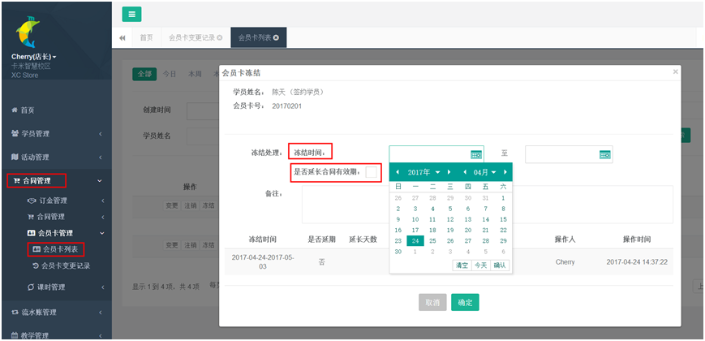
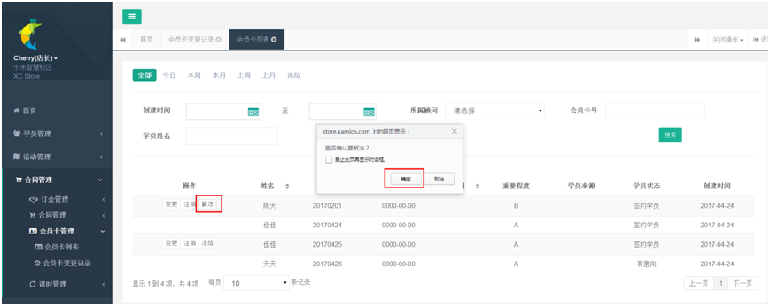
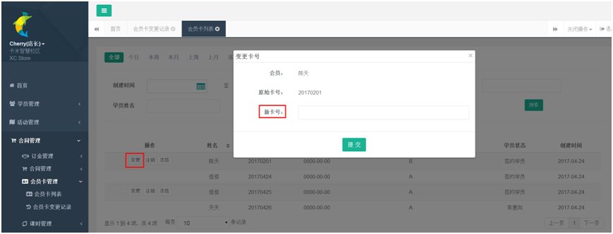
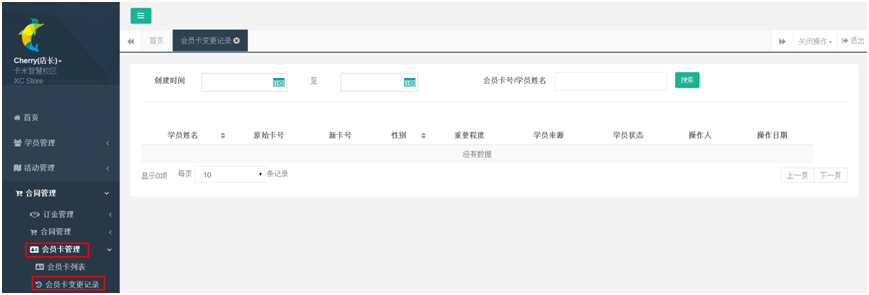

title:会员卡管理-卡米智慧校区
keywords:卡米智慧校区,早教管理系统,教育管理系统,会员卡系统,学生管理系统,早教CRM,学员卡系统,学校管理系统,SAAS,卡米早幼教管理系统,kamios,Kami早教管家,早教SAAS,早教中心管理系统,早教中心招生排课系统,排课软件,培训学校管理系统,培训学校管理软件,培训机构管理系统,培训机构管理软件,早教信息管理系统,排课管理,老师管理,家校互联,龙格亲子游泳,美吉姆,夏加儿,杨梅红,能力风暴
description:卡米智慧校区是全球部署的教育培训机构SAAS管理系统。卡米智慧校区致力于技术和教育的结合，为早幼教培训机构提供更优质的招生管理、合同会员卡管理、教务排课管理、推广运营等系统化的解决方案，为提高教育从业者的工作效率不懈努力，助力机构快速打造互联网+智慧云校区。
tags:学员管理系统,会员卡管理系统,早教中心学员管理,会员管理软件,会员卡管理软件,更改会员卡号
url:hyk.html

###1、会员卡的冻结与解冻
在早教培训机构或其他类型的教育培训机构的实际运营中，会遇到学员请假时间过长的情况，这个时候可选择冻结会员卡。
（1）、选择冻结时间，核实是否需要延长有效期。

（2）、恢复上课解冻账户即可，点击【解冻】。

###2、会员卡变更
会员卡变更或者补卡：在【会员卡列表】中筛选待变更卡号学员，点击【变更】，输入新的卡号，即完成了会员卡号的更改。

###3、会员卡变更记录查询
所有会员卡变更信息，可在会员卡变更记录中查询。
