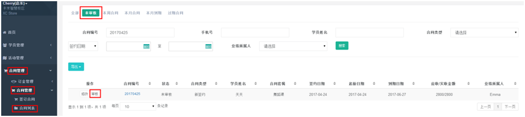
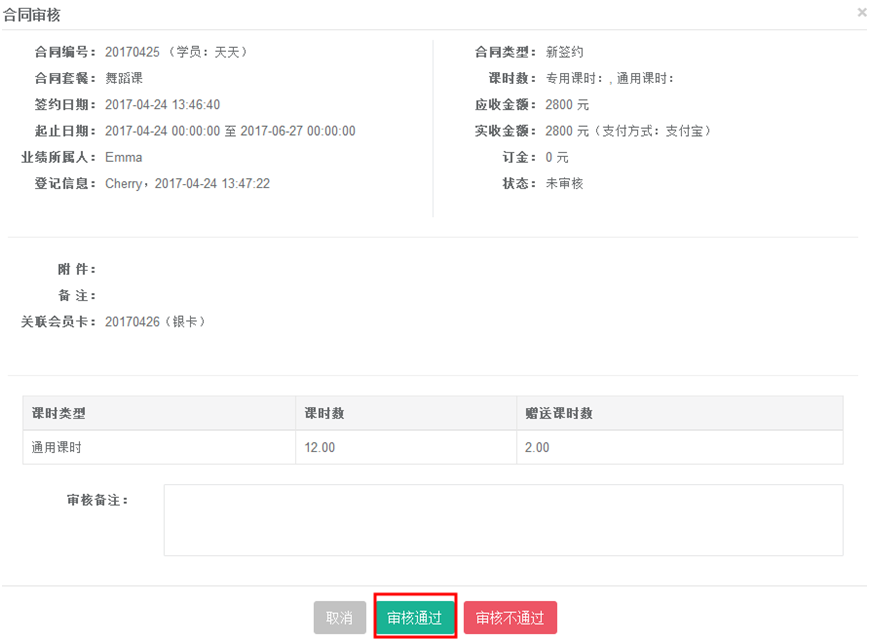
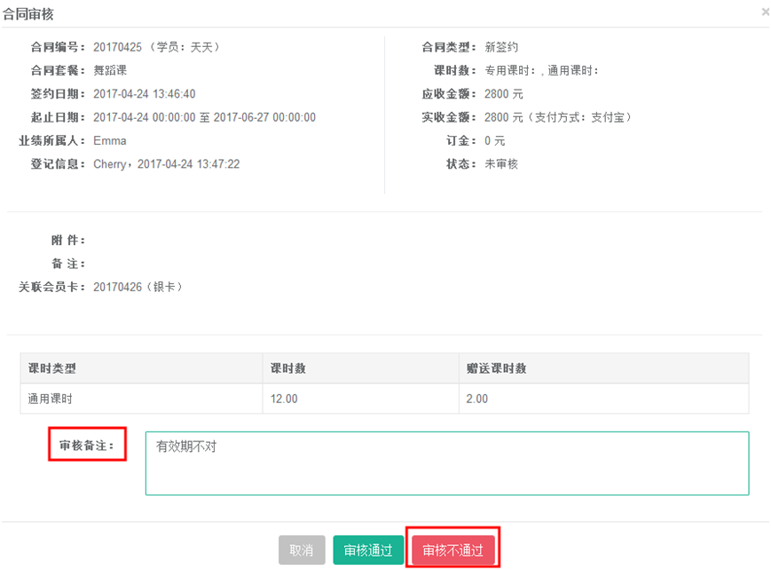
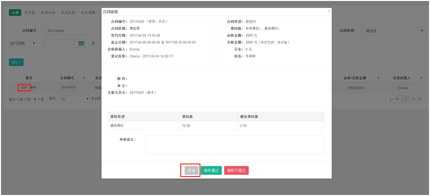
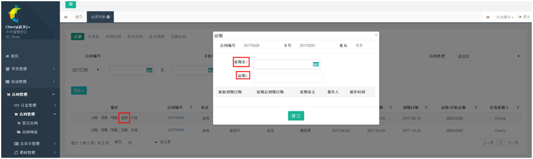
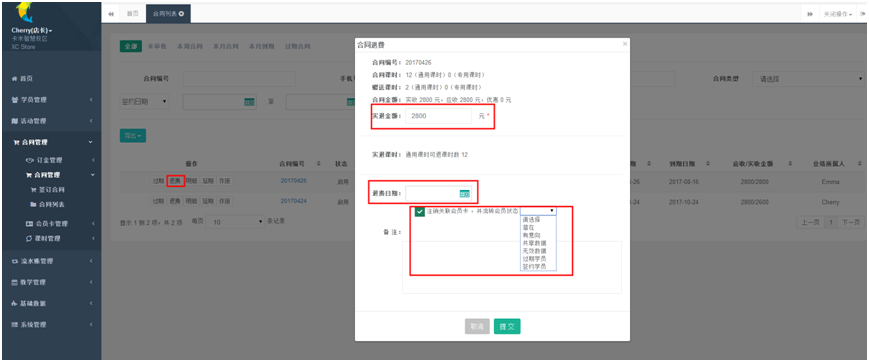
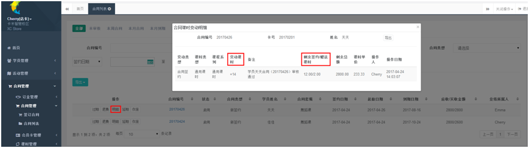
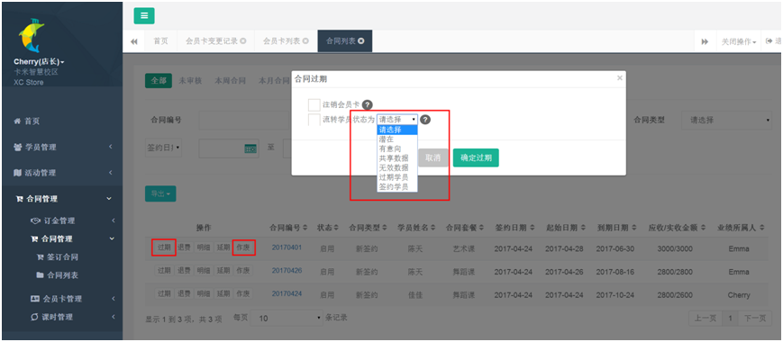

title:合同审核-卡米智慧校区
keywords:卡米智慧校区,早教管理系统,教育管理系统,会员卡系统,学生管理系统,早教CRM,学员卡系统,学校管理系统,SAAS,卡米早幼教管理系统,kamios,Kami早教管家,早教SAAS,早教中心管理系统,早教中心招生排课系统,排课软件,培训学校管理系统,培训学校管理软件,培训机构管理系统,培训机构管理软件,早教信息管理系统,排课管理,老师管理,家校互联,龙格亲子游泳,美吉姆,夏加儿,杨梅红,能力风暴
description:卡米智慧校区是全球部署的教育培训机构SAAS管理系统。卡米智慧校区致力于技术和教育的结合，为早幼教培训机构提供更优质的招生管理、合同会员卡管理、教务排课管理、推广运营等系统化的解决方案，为提高教育从业者的工作效率不懈努力，助力机构快速打造互联网+智慧云校区。
tags:早教管理系统,会员卡管理系统,会员卡系统,学生管理系统,早教CRM,学员卡系统,学校管理系统,卡米智慧云SAAS,卡米早幼教管理系统,kamios,Kami早教管家,早教SAAS,早教中心管理系统,早教中心招生排课系统,排课软件,培训学校管理系统,培训学校管理软件,培训机构管理系统,培训机构管理软件,早教信息管理系统
url:htsh.html

###4.3、合同如何审核？
【合同管理】-【合同管理】-【合同列表】-【未审核】-【审核】。

4.3.1、审核无误，点击审核通过，合同生效，业绩得到自动统计；

4.3.2、审核有误处理方式
（1）、方式一在审核备注填写不予通过原因，点击【审核不通过】，需在合同列表中删除并重新提交。

（2）、方式二点击取消，回到合同列表，找到该合同，点击修改，无误后审核合同。

注意：
（1）、若同一会员签约不同课程系列，需分别录入系统进行合同审核。
（2）、审核之前合同可以进行修改，审核通过后，合同只能延期，无法作其他修改。 
4.3.3、如上课以后，需要延长上课时间，则在【合同列表】中找到该学员，点击【延期】，选择延期日期并进行说明。

4.3.4、若学员要进行退款，则在【合同列表】中找到该学员，点击【退费】，确认退款金额以及退款日期并对退款进行说明。可勾选注销会员卡，并流转会员状态，并于后期跟进。

4.3.5、若学员要查询课时情况，可以在在【合同列表】中找到该学员，点击【明细】。

4.3.6、如果该学员合同过期或者作废，点击过期或者作废，可选择是否注销会员卡，流转会员状态用于后期跟进。
