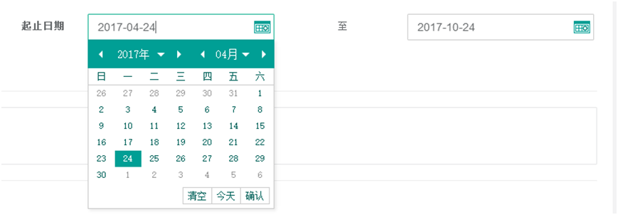

title:签订合同-卡米智慧校区
keywords:卡米智慧校区,早教管理系统,教育管理系统,会员卡系统,学生管理系统,早教CRM,学员卡系统,学校管理系统,SAAS,卡米早幼教管理系统,kamios,Kami早教管家,早教SAAS,早教中心管理系统,早教中心招生排课系统,排课软件,培训学校管理系统,培训学校管理软件,培训机构管理系统,培训机构管理软件,早教信息管理系统,排课管理,老师管理,家校互联,龙格亲子游泳,美吉姆,夏加儿,杨梅红,能力风暴
description:卡米智慧校区是全球部署的教育培训机构SAAS管理系统。卡米智慧校区致力于技术和教育的结合，为早幼教培训机构提供更优质的招生管理、合同会员卡管理、教务排课管理、推广运营等系统化的解决方案，为提高教育从业者的工作效率不懈努力，助力机构快速打造互联网+智慧云校区。
tags:早教管理系统,会员卡管理系统,会员卡系统,学生管理系统,早教CRM,学员卡系统,学校管理系统,卡米智慧云SAAS,卡米早幼教管理系统,kamios,Kami早教管家,早教SAAS,早教中心管理系统,早教中心招生排课系统,排课软件,培训学校管理系统,培训学校管理软件,培训机构管理系统,培训机构管理软件,早教信息管理系统
url:qdht.html

###1、如何进行合同签约？
【合同管理】-【合同管理】-【签订合同】-通过快速搜索找出目标客户点击【签约】。

###2、合同基本信息如何填写？

###3、合同填写注意事项有哪些？
（1）、【合同编号】为纸质合同显示的编号。
（2）、【合同类型】根据学员情况进行选择：新签约，续约，赠送。
（3）、【业绩所属人】选择所签约的销售。
（4）、【合同套餐】选择学员所报名的课时套餐。
（5）、【赠课】通用课时如有赠课，填写对应赠课数。无赠课，填写0。
（6）、【课时类型】分为通用课时和专用课时。
a、通用课时：中心所有开设的课程该学员都可以进行预约并正常签到扣课上课。
b、专用课时：该学员只能上固定的课程系列。

（7）、【套餐金额】是系统设置，如果该学员是有折扣，可在【实收金额】填写实际的费用，如有支付订金，则填写扣减订金后的剩余支付费用。

（8）、在【签约日期】中选择日期，

如果之前有支付过订金，会显示支付订金时间：

（9）、通过【附件】可将签订的纸质合同或者其他说明文件拍照上传至系统。

（10）、在【起止日期】中选择所签约课时的有效期。

（11）、【备注】主要为学员的特殊需求、优惠情况、优惠原因、补齐余款的时间、赠送内容等信息。

（12）、在【开卡方式】选择使用的是新卡还是旧卡，【卡类型】选择卡型。如若会员卡需要等待，则可输入合同编号，等待会员卡办理成功之后，通过会员卡列表进行变更。。

###4、续约以及赠课合同签约注意事项
（1）、【签约方式】选择续约或者赠课，其他同上述新签约一样。
（2）、赠课合同只要是记录除常用课时套餐外的课时包。
###5、由财务部收到款项后，进行账户款项审核：
（1）审核无误后，进行合同审核；
（2）如果金额有误，由财务人员和销售核实金额的情况，待实收款项与合同总金额收款无误后，进行合同审核。