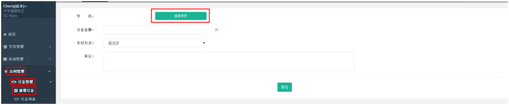

title:订金管理-卡米智慧校区
keywords:卡米智慧校区,早教管理系统,教育管理系统,会员卡系统,学生管理系统,早教CRM,学员卡系统,学校管理系统,SAAS,卡米早幼教管理系统,kamios,Kami早教管家,早教SAAS,早教中心管理系统,早教中心招生排课系统,排课软件,培训学校管理系统,培训学校管理软件,培训机构管理系统,培训机构管理软件,早教信息管理系统,排课管理,老师管理,家校互联,龙格亲子游泳,美吉姆,夏加儿,杨梅红,能力风暴
description:卡米智慧校区是全球部署的教育培训机构SAAS管理系统。卡米智慧校区致力于技术和教育的结合，为早幼教培训机构提供更优质的招生管理、合同会员卡管理、教务排课管理、推广运营等系统化的解决方案，为提高教育从业者的工作效率不懈努力，助力机构快速打造互联网+智慧云校区。
tags:早教管理系统,会员卡管理系统,会员卡系统,学生管理系统,早教CRM,学员卡系统,学校管理系统,卡米智慧云SAAS,卡米早幼教管理系统,kamios,Kami早教管家,早教SAAS,早教中心管理系统,早教中心招生排课系统,排课软件,培训学校管理系统,培训学校管理软件,培训机构管理系统,培训机构管理软件,早教信息管理系统
url:djgl.html

###1、卡米智慧校区管理系统在哪里添加订金？
【合同管理】-【订金管理】-【新增订金】

###2、订金填写注意事项？
选择对应的学员，填写订金金额，选择支付方式，如有说明进行备注。

###3、订金列表的查看及管理
顾问、主管需及时审核【订金列表】，查看记录，及时收回全款，避免学员流失。如图：

###4、交了订金签约后如何审核?
财务可通过【流水账管理】-【流水账列表】对订金进行审核。
审核表示财务已经收到款项。需要注意的是：合同签约后，合同金额是自动审核并入账的，订金是需要财务流水账列表页面自己点审核入账的。因为订金通常是在签约后财务才与合同一起做实际的入账操作。
