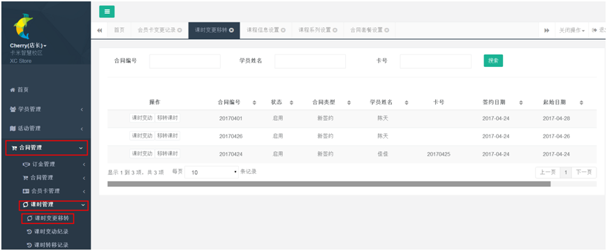
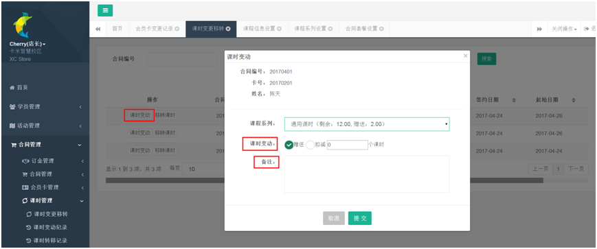
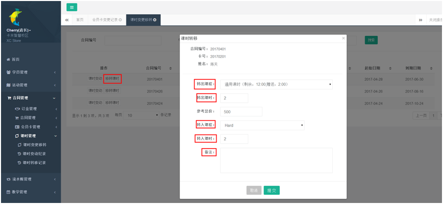
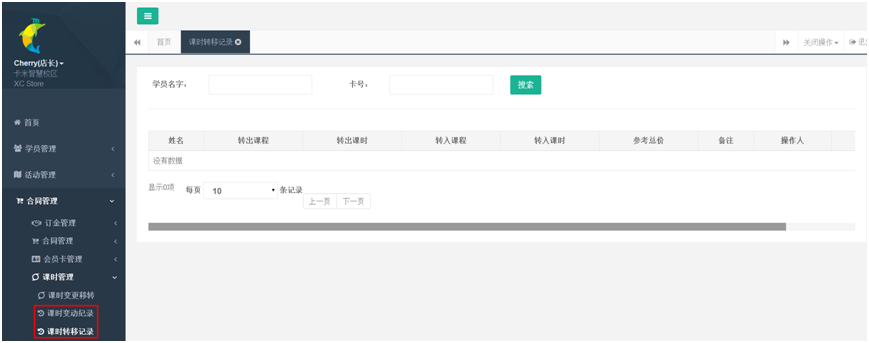

title:课时管理-卡米智慧校区
keywords:卡米智慧校区,早教管理系统,教育管理系统,会员卡系统,学生管理系统,早教CRM,学员卡系统,学校管理系统,SAAS,卡米早幼教管理系统,kamios,Kami早教管家,早教SAAS,早教中心管理系统,早教中心招生排课系统,排课软件,培训学校管理系统,培训学校管理软件,培训机构管理系统,培训机构管理软件,早教信息管理系统,排课管理,老师管理,家校互联,龙格亲子游泳,美吉姆,夏加儿,杨梅红,能力风暴
description:卡米智慧校区是全球部署的教育培训机构SAAS管理系统。卡米智慧校区致力于技术和教育的结合，为早幼教培训机构提供更优质的招生管理、合同会员卡管理、教务排课管理、推广运营等系统化的解决方案，为提高教育从业者的工作效率不懈努力，助力机构快速打造互联网+智慧云校区。
tags:早教管理系统,会员卡管理系统,会员卡系统,学生管理系统,早教CRM,学员卡系统,学校管理系统,卡米智慧云SAAS,卡米早幼教管理系统,kamios,Kami早教管家,早教SAAS,早教中心管理系统,早教中心招生排课系统,排课软件,培训学校管理系统,培训学校管理软件,培训机构管理系统,培训机构管理软件,早教信息管理系统
url:ksgl.html

###1、签约学员的课时增加减少在哪里操作？
【合同管理】-【课时管理】-【课时变更转移】。

###2、课时变更如何操作？
如果学员课时有多扣课或者少扣课，或者有特殊情况增加课时，通过【赠送】或者【扣减】完成相应的课时变动。

###3、如何进行校区内的课时转移？
将课时套餐中某个课程数转移到另外一个课程。选择转入转出的课程，课时数以及备注原因。

###4、在哪里查看学员的课时变动记录？
通过在【合同管理】中的【课时变动记录】和【课时转移记录】查看该学员课时情况。
