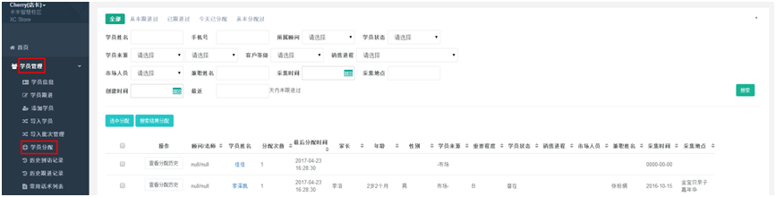
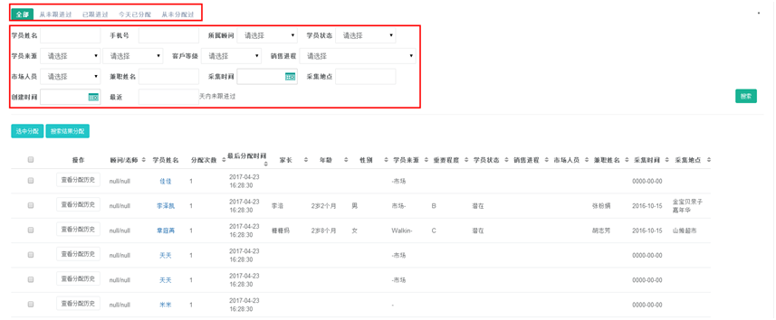
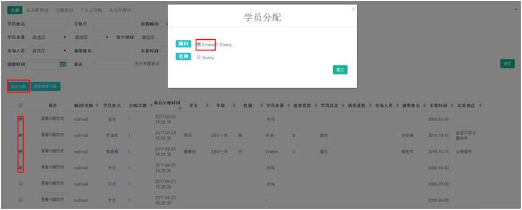
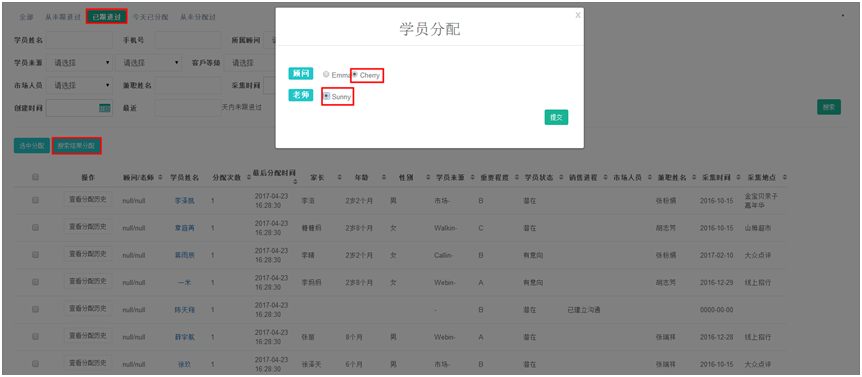

title:名单分配-卡米智慧校区
keywords:卡米智慧校区,早教管理系统,教育管理系统,会员卡系统,学生管理系统,早教CRM,学员卡系统,学校管理系统,SAAS,卡米早幼教管理系统,kamios,Kami早教管家,早教SAAS,早教中心管理系统,早教中心招生排课系统,排课软件,培训学校管理系统,培训学校管理软件,培训机构管理系统,培训机构管理软件,早教信息管理系统,排课管理,老师管理,家校互联,龙格亲子游泳,美吉姆,夏加儿,杨梅红,能力风暴
description:卡米智慧校区是全球部署的教育培训机构SAAS管理系统。卡米智慧校区致力于技术和教育的结合，为早幼教培训机构提供更优质的招生管理、合同会员卡管理、教务排课管理、推广运营等系统化的解决方案，为提高教育从业者的工作效率不懈努力，助力机构快速打造互联网+智慧云校区。
tags:早教管理系统,会员卡管理系统,会员卡系统,学生管理系统,早教CRM,学员卡系统,学校管理系统,卡米智慧云SAAS,卡米早幼教管理系统,kamios,Kami早教管家,早教SAAS,早教中心管理系统,早教中心招生排课系统,排课软件,培训学校管理系统,培训学校管理软件,培训机构管理系统,培训机构管理软件,早教信息管理系统
url:mdfp.html

###1、进入菜单学员管理-学员分配
通过【学员管理】中的【学员分配】进入学员分配列表，进行学员名单分配。

###2、学员分配页面介绍

通过搜索框或者快速筛选，筛选出待分配的数据： 

###3、学员名单分配方式

####方式一：选中分配
点击名单前方的方框，勾选后的名单可分配给其中某位顾问或老师。

####方式二：搜索结果分配
根据搜索结果将名单分配给其中某位顾问或者老师。
