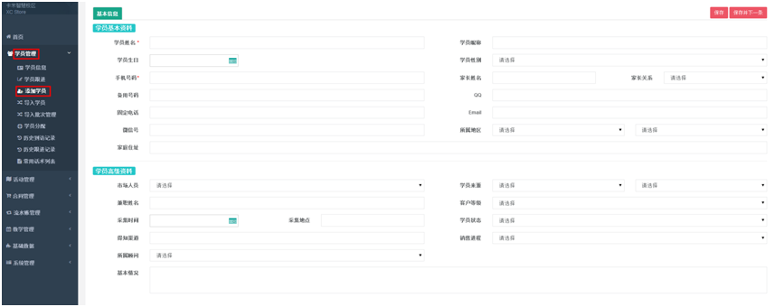
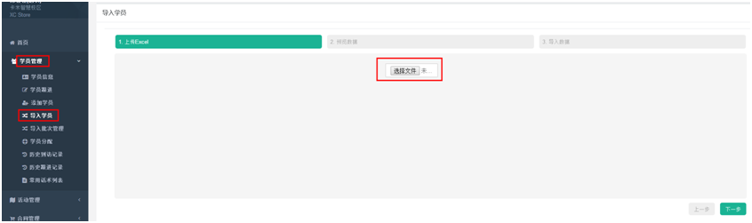
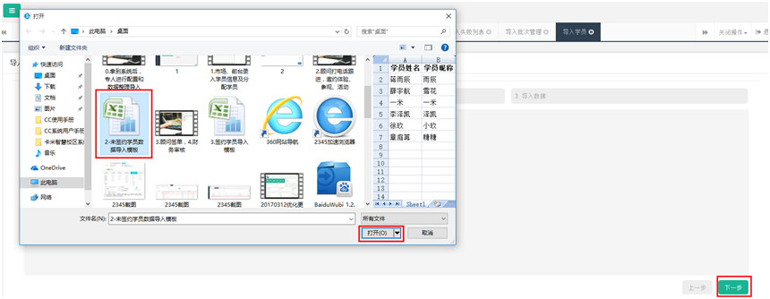
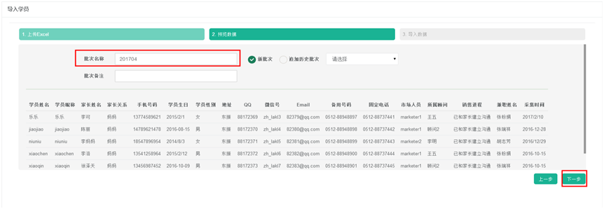
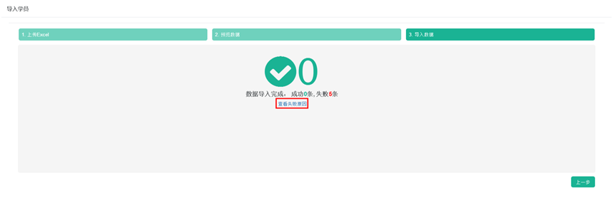
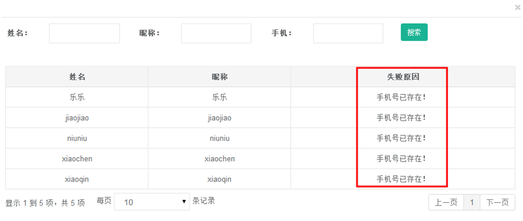
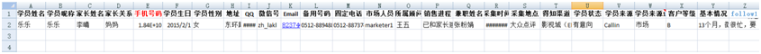
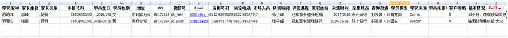
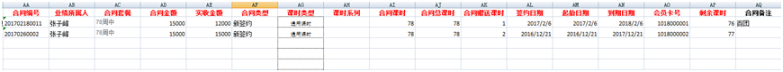
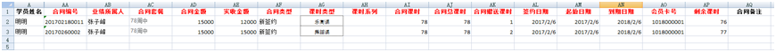

title:名单导入-卡米智慧校区
keywords:卡米智慧校区,早教管理系统,教育管理系统,会员卡系统,学生管理系统,早教CRM,学员卡系统,学校管理系统,SAAS,卡米早幼教管理系统,kamios,Kami早教管家,早教SAAS,早教中心管理系统,早教中心招生排课系统,排课软件,培训学校管理系统,培训学校管理软件,培训机构管理系统,培训机构管理软件,早教信息管理系统,排课管理,老师管理,家校互联,龙格亲子游泳,美吉姆,夏加儿,杨梅红,能力风暴
description:卡米智慧校区是全球部署的教育培训机构SAAS管理系统。卡米智慧校区致力于技术和教育的结合，为早幼教培训机构提供更优质的招生管理、合同会员卡管理、教务排课管理、推广运营等系统化的解决方案，为提高教育从业者的工作效率不懈努力，助力机构快速打造互联网+智慧云校区。
tags:早教管理系统,会员卡管理系统,会员卡系统,学生管理系统,早教CRM,学员卡系统,学校管理系统,卡米智慧云SAAS,卡米早幼教管理系统,kamios,Kami早教管家,早教SAAS,早教中心管理系统,早教中心招生排课系统,排课软件,培训学校管理系统,培训学校管理软件,培训机构管理系统,培训机构管理软件,早教信息管理系统
url:mddr.html

Tips: 不同渠道获取的客户人员资料建议当日完成录入系统，以便能及时分配并进行跟进。
###1、手动添加学员
手动添加学员操作如图：【学员管理】-【添加学员】-【保存】。

添加学员名单注意事项：
（1）、必填项是2个：学员姓名（亦可填写昵称，中英文皆可），手机号码。
（2）、其次：市场人员、兼职名单、学员来源、客户等级、采集时间、采集地点、学员状态和销售进程。

* 延伸问题：
    >[如何添加一项新的学员来源选项？(target=_blank)](https://help.kamios.cn/ji-chu-shu-ju-she-zhi/xue-yuan-xin-xi-she-zhi?keyword=%E5%AD%A6%E5%91%98%E6%9D%A5%E6%BA%90%E8%AE%BE%E7%BD%AE)
    > [所属顾问为什么没有?(target=_blank)](https://help.kamios.cn/xi-tong-guan-li/yong-hu-guan-li?keyword=%E6%B3%A8%E6%84%8F%E4%BA%8B%E9%A1%B9)
    > [市场人员下拉选项为什么是空白的？(target=_blank)](https://help.kamios.cn/xi-tong-guan-li/yong-hu-guan-li?keyword=%E6%B3%A8%E6%84%8F%E4%BA%8B%E9%A1%B9)
    
###2、批量导入学员

批量导入学员操作如图：【学员管理】-【导入学员】

（1）、点击【选择文件】，选择所要导入的文件：

（2）、填写【批次名称】和【批次备注】，如有补充选择【追加历史批次】。

（3）、如果数据无误，会提示导入成功。如果显示导入失败，点击查看失败原因。

###3、添加/导入学员名单注意事项

（1）	未签约学员数据导入模板：

（2）	签约会员数据导入模板（两图为同一行）：

a、	不要删除列，有数据就填写，没数据就留空。标红字段为必填。
b、	所有下拉选项的数据需要与系统中的下拉选项数据一致，否则导入为空白。
c、	**已经签约学员数据导入，请在一对一客服人员指导下导入。**
        数据表格的整理格式如上。
        如果有会员有多张合同，请按最后两行要求导入。学员基本信息一致，会员卡一致，合同编号不一致即可导入一个学员两份或多份合同。
        合同课时=系统中合同套餐的课时
        合同总课时=系统中合同套餐的课时
        合同赠送课时=合同赠送课时
        剩余课时=剩余课时（不包含赠送课时）
        合同信息均为必填项。
（3）、如果同一会员，报名多种课程，需要分行填写。学员基本信息致，会员卡一样，其他合同信息根据实际情况填写。

###4、导入的特殊情况的处理

（1）【手机号码】出现相同，会提示导入失败，系统内手机号码唯一存在。
（2）针对同一家庭多个子女，同一个手机号码的情况解决方案：【手机号码】填写为同一家长备用的手机号码或者是其他家长关系成员的手机号码。
（3）针对个别机构多子女共用课包上课的解决办法：分别录入多个子女的学员信息，合同在系统内各签约一份相同的，然后做课时扣减处理。

###5、学员导入模板的下载

[未签约学员数据导入模板](/wenjian/2017wqy.xlsx)
[签约学员导入模板](/wenjian/2017qy.xlsx)