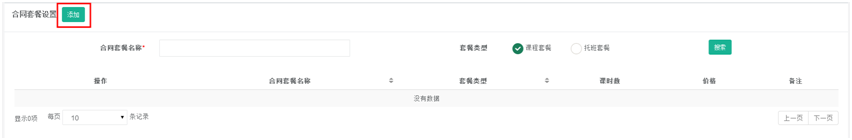

title:合同信息设置-卡米智慧校区
keywords:卡米智慧校区,早教管理系统,教育管理系统,会员卡系统,学生管理系统,早教CRM,学员卡系统,学校管理系统,SAAS,卡米早幼教管理系统,kamios,Kami早教管家,早教SAAS,早教中心管理系统,早教中心招生排课系统,排课软件,培训学校管理系统,培训学校管理软件,培训机构管理系统,培训机构管理软件,早教信息管理系统,排课管理,老师管理,家校互联,龙格亲子游泳,美吉姆,夏加儿,杨梅红,能力风暴
description:卡米智慧校区是全球部署的教育培训机构SAAS管理系统。卡米智慧校区致力于技术和教育的结合，为早幼教培训机构提供更优质的招生管理、合同会员卡管理、教务排课管理、推广运营等系统化的解决方案，为提高教育从业者的工作效率不懈努力，助力机构快速打造互联网+智慧云校区。
tags:早教管理系统,会员卡管理系统,会员卡系统,学生管理系统,早教CRM,学员卡系统,学校管理系统,卡米智慧云SAAS,卡米早幼教管理系统,kamios,Kami早教管家,早教SAAS,早教中心管理系统,早教中心招生排课系统,排课软件,培训学校管理系统,培训学校管理软件,培训机构管理系统,培训机构管理软件,早教信息管理系统
url:htxxsz.html

###1、在哪里对合同套餐设置？
**路径：基础数据设置-合同信息设置-合同套餐设置**
（1）点击左上角【添加】。

（2）点击【添加课程系列】，添加所要增加的课程系列名称。
         课程系列为校区所开设的课程系列名称。

（3）信息填写完整，点击保存，页面显示所添加合同套餐即为成功。

###2、支付方式在哪里设置？
**路径：基础数据设置-合同信息设置-支付方式设置**
系统中默认为5个支付方式，默认的方式无法进行删除或者修改。
如若要添加新支付方式，点击上图红框【添加支付方式】，填写方式，点击添加即可（添加的方式是可以进行修改或者删除）。

###3、会员卡类型设置
**路径：基础数据设置-合同信息设置-会员卡类型设置**
系统中默认为3个会员卡类型，默认的方式无法进行删除或者修改。
如若要添加新会员卡类型，点击上图红框【添加会员卡类型】，填写类型，点击添加即可（添加的类型是可以进行修改或者删除）。
不使用会员卡的校区机构可以添加一个默认选项比如就叫会员卡或“品牌名称+会员卡”这样来表示。

###4、收入类型设置
**路径：基础数据设置-合同信息设置-收入类型设置**
系统中默认为6个收入类型，默认的类型无法进行删除或者修改。
如若要添加新收入类型，点击上图红框【添加收入类型】，填写类型，点击添加即可（添加的类型是可以进行修改或者删除）。

###5、支出类型设置
**路径：基础数据设置-合同信息设置-支出类型设置**
系统中默认为7个支出类型，默认的类型无法进行删除或者修改。
如若要添加新收入类型，点击上图红框【添加支出类型】，填写类型，点击添加即可（添加的类型是可以进行修改或者删除）。
