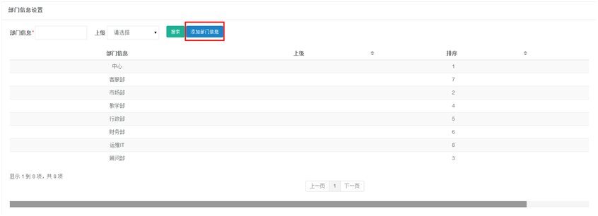
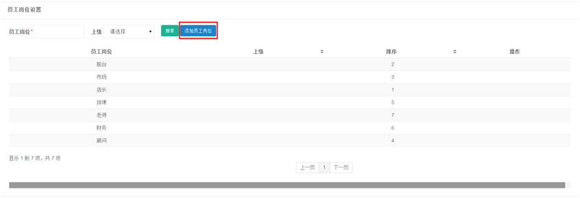
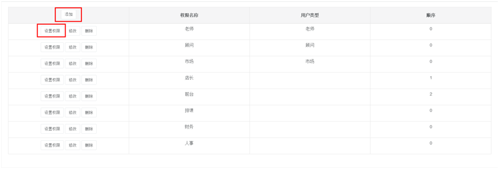
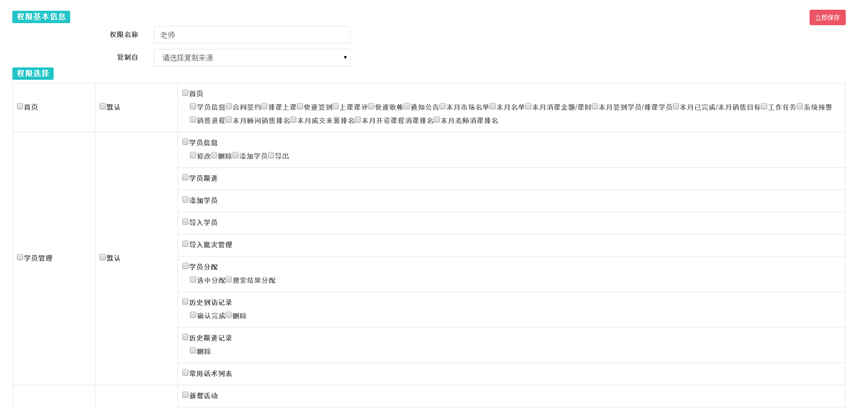

title:基础信息设置-卡米智慧校区
keywords:卡米智慧校区,早教管理系统,教育管理系统,会员卡系统,学生管理系统,早教CRM,学员卡系统,学校管理系统,SAAS,卡米早幼教管理系统,kamios,Kami早教管家,早教SAAS,早教中心管理系统,早教中心招生排课系统,排课软件,培训学校管理系统,培训学校管理软件,培训机构管理系统,培训机构管理软件,早教信息管理系统,排课管理,老师管理,家校互联,龙格亲子游泳,美吉姆,夏加儿,杨梅红,能力风暴
description:卡米智慧校区是全球部署的教育培训机构SAAS管理系统。卡米智慧校区致力于技术和教育的结合，为早幼教培训机构提供更优质的招生管理、合同会员卡管理、教务排课管理、推广运营等系统化的解决方案，为提高教育从业者的工作效率不懈努力，助力机构快速打造互联网+智慧云校区。
tags:早教管理系统,会员卡管理系统,会员卡系统,学生管理系统,早教CRM,学员卡系统,学校管理系统,卡米智慧云SAAS,卡米早幼教管理系统,kamios,Kami早教管家,早教SAAS,早教中心管理系统,早教中心招生排课系统,排课软件,培训学校管理系统,培训学校管理软件,培训机构管理系统,培训机构管理软件,早教信息管理系统
url:jcxxsz.html

###1、部门信息设置
**路径：基础数据设置-基础信息设置-部门信息设置**
系统中默认为8个部门，默认的部门信息无法进行删除或者修改。
如若要添加新部门，点击上图红框【添加部门信息】，填写部门名称，点击添加即可（添加的部门是可以进行修改或者删除）。

###2、员工岗位设置
**路径：基础数据设置-基础信息设置-员工岗位设置**
系统中默认为7个岗位，默认的岗位无法进行删除或者修改。
如若要添加新岗位，点击上图红框【添加员工岗位】，填写岗位名称，点击添加即可（添加的岗位是可以进行修改或者删除）。

###3、权限设置
**路径：基础数据设置-基础信息设置-权限设置**
（1）卡米智慧校区管理系统根据不同校区的人员配置，为各校区推荐了相应的角色权限，可以通过设置权限来选择复制所推荐的权限。
可通过【添加】或【修改】来设置新的角色名称。
可通过相应角色前面的【权限设置】来设置或修改默认角色权限。

（2）举例设置老师权限，点击权限名称“老师”前方的设置权限，显示如下图（此时老师权限还未开通）：

（3）点击复制，选择跟权限名称一致，系统会自动显示默认的权限，如果要增加或者减少权限，点击该权限的方框即可。