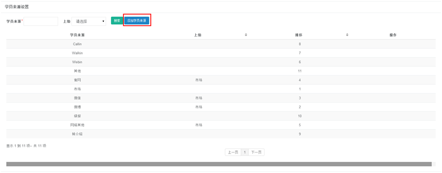
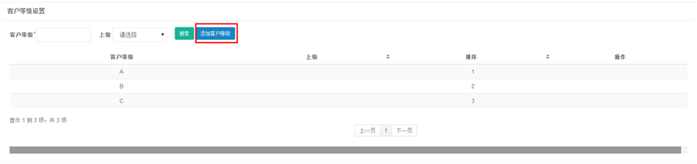
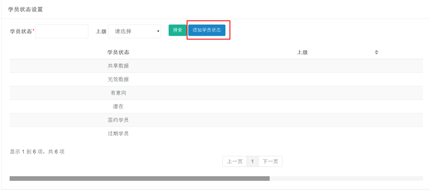
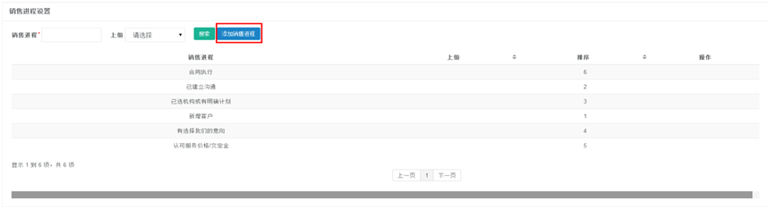
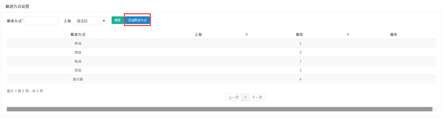
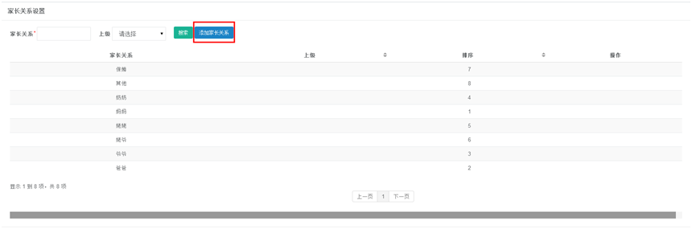

title:学员信息设置-卡米智慧校区
keywords:卡米智慧校区,早教管理系统,教育管理系统,会员卡系统,学生管理系统,早教CRM,学员卡系统,学校管理系统,SAAS,卡米早幼教管理系统,kamios,Kami早教管家,早教SAAS,早教中心管理系统,早教中心招生排课系统,排课软件,培训学校管理系统,培训学校管理软件,培训机构管理系统,培训机构管理软件,早教信息管理系统,排课管理,老师管理,家校互联,龙格亲子游泳,美吉姆,夏加儿,杨梅红,能力风暴
description:卡米智慧校区是全球部署的教育培训机构SAAS管理系统。卡米智慧校区致力于技术和教育的结合，为早幼教培训机构提供更优质的招生管理、合同会员卡管理、教务排课管理、推广运营等系统化的解决方案，为提高教育从业者的工作效率不懈努力，助力机构快速打造互联网+智慧云校区。
tags:早教管理系统,会员卡管理系统,会员卡系统,学生管理系统,早教CRM,学员卡系统,学校管理系统,卡米智慧云SAAS,卡米早幼教管理系统,kamios,Kami早教管家,早教SAAS,早教中心管理系统,早教中心招生排课系统,排课软件,培训学校管理系统,培训学校管理软件,培训机构管理系统,培训机构管理软件,早教信息管理系统
url:xyxxsz.html

###1、学员来源设置
**路径：基础数据设置-学员信息设置-学员来源设置**
系统中默认为11个来源，默认的来源无法进行删除或者修改。
如若要添加新来源，点击上图红框【添加学员来源】，填写来源，点击添加即可（添加的来源是可以进行修改或者删除）。

###2、客户等级设置
**路径：基础数据设置-学员信息设置-客户等级设置**
系统中默认为3个等级，默认的等级无法进行删除或者修改。
如若要添加新等级，点击上图红框【添加客户等级】，填写等级，点击添加即可（添加的等级是可以进行修改或者删除）。

###3、学员状态设置
**路径：基础数据设置-学员信息设置-学员状态设置**  建议使用系统默认设置，无需添加。
系统中默认为6个学员状态，默认的状态无法进行删除或者修改。
如若要添加新状态，点击上图红框【添加学员状态】，填写状态，点击添加即可（添加的状态是可以进行修改或者删除）。

###4、销售进程设置
**路径：基础数据设置-学员信息设置-销售进程设置**  建议使用系统默认设置，无需添加。
系统中默认为6个销售进程，默认的销售进程无法进行删除或者修改。
如若要添加新进程，点击上图红框【添加销售进程】，填写进程，点击添加即可（添加的销售进程是可以进行修改或者删除）。

###5、跟进方式设置
**路径：基础数据设置-学员信息设置-跟进方式设置**  建议使用系统默认设置，无需添加。
系统中默认为6个跟进方式，默认的方式无法进行删除或者修改。
如若要添加新跟进方式，点击上图红框【添加跟进方式】，填写方式，点击添加即可（添加的方式是可以进行修改或者删除）。

###6、家长关系设置
**路径：基础数据设置-学员信息设置-家长关系设置** 
系统中默认为8个家长关系，默认的关系无法进行删除或者修改。
如若要添加新家长关系，点击上图红框【添加家长关系】，填写关系，点击添加即可（添加的关系是可以进行修改或者删除）。

###7、活动类别设置
**路径：基础数据设置-学员信息设置-活动类别设置**  建议使用系统默认设置，无需添加。
系统中默认为16个活动类别，默认的类别无法进行删除或者修改。
如若要添加新活动类别，点击上图红框【添加活动类别】，填写类别，点击添加即可（添加的类别是可以进行修改或者删除）。