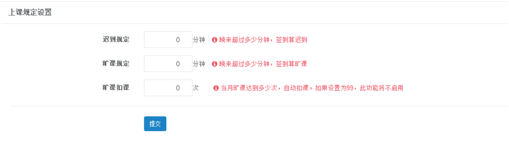

title:教务信息设置-卡米智慧校区
keywords:卡米智慧校区,早教管理系统,教育管理系统,会员卡系统,学生管理系统,早教CRM,学员卡系统,学校管理系统,SAAS,卡米早幼教管理系统,kamios,Kami早教管家,早教SAAS,早教中心管理系统,早教中心招生排课系统,排课软件,培训学校管理系统,培训学校管理软件,培训机构管理系统,培训机构管理软件,早教信息管理系统,排课管理,老师管理,家校互联,龙格亲子游泳,美吉姆,夏加儿,杨梅红,能力风暴
description:卡米智慧校区是全球部署的教育培训机构SAAS管理系统。卡米智慧校区致力于技术和教育的结合，为早幼教培训机构提供更优质的招生管理、合同会员卡管理、教务排课管理、推广运营等系统化的解决方案，为提高教育从业者的工作效率不懈努力，助力机构快速打造互联网+智慧云校区。
tags:早教管理系统,会员卡管理系统,会员卡系统,学生管理系统,早教CRM,学员卡系统,学校管理系统,卡米智慧云SAAS,卡米早幼教管理系统,kamios,Kami早教管家,早教SAAS,早教中心管理系统,早教中心招生排课系统,排课软件,培训学校管理系统,培训学校管理软件,培训机构管理系统,培训机构管理软件,早教信息管理系统
url:jwxxsz.html

###1、如何添加课程系列？
**路径：基础数据设置-教务信息设置-课程系列设置**
点击【添加课程系列】，添加所要增加的课程名称。
课程系列是一个校区所开设课程的科目类别，也可以理解为可以单独售卖的科目类别;

###2、如果添加课程信息？
**路径：基础数据设置-教务信息设置-课程信息设置**
（1）、点击【添加】。

（2）、填写课程名称，选择课程系列，所需要扣课时数，适合年龄，容量，添加完成后点击保存即可。
容量有两种安排方式：
a、	设置总数，会员+体验人数在总数内即可。
b、	会员和体验分别设置人数限制，对应数量满员后，无法再添加。

###3、上课规定在哪里设置？
**路径：基础数据设置-教务信息设置-上课规定设置**
根据各校区自身情况进行设置。

###4、上课教室在哪里设置？
**路径：基础数据设置-教务信息设置-上课教室设置**
点击“添加上课教室”，填写教室名称，点击添加即可。

###5、上课时间在哪里设置？
**路径：基础数据设置-教务信息设置-上课时间设置**
点击“添加上课时间”，根据上课时间进行添加。

###6、课评项目在哪里设置？
**路径：基础数据设置-教务信息设置-课评项目设置**
点击“添加课评项目”，可根据上课情况进行点评。
