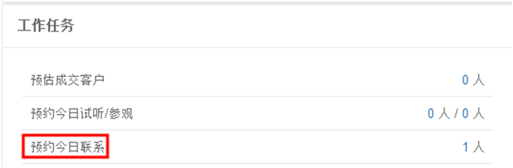

title:学员跟进-卡米智慧校区
keywords:卡米智慧校区,早教管理系统,教育管理系统,会员卡系统,学生管理系统,早教CRM,学员卡系统,学校管理系统,SAAS,卡米早幼教管理系统,kamios,Kami早教管家,早教SAAS,早教中心管理系统,早教中心招生排课系统,排课软件,培训学校管理系统,培训学校管理软件,培训机构管理系统,培训机构管理软件,早教信息管理系统,排课管理,老师管理,家校互联,龙格亲子游泳,美吉姆,夏加儿,杨梅红,能力风暴
description:卡米智慧校区是全球部署的教育培训机构SAAS管理系统。卡米智慧校区致力于技术和教育的结合，为早幼教培训机构提供更优质的招生管理、合同会员卡管理、教务排课管理、推广运营等系统化的解决方案，为提高教育从业者的工作效率不懈努力，助力机构快速打造互联网+智慧云校区。
tags:早教管理系统,会员卡管理系统,会员卡系统,学生管理系统,早教CRM,学员卡系统,学校管理系统,卡米智慧云SAAS,卡米早幼教管理系统,kamios,Kami早教管家,早教SAAS,早教中心管理系统,早教中心招生排课系统,排课软件,培训学校管理系统,培训学校管理软件,培训机构管理系统,培训机构管理软件,早教信息管理系统
url:xygj.html

###1、如何进行学员跟进？
**路径：学员管理-学员跟进**
学员管理可以理解为我们学用的CRM（客户关系管理系统），在这里可以对学员的每次跟进做记录跟踪。
点击【跟进学员】，显示如图页面：

####1.1、跟进方式如何选择？
跟进方式选择（可在方框内简单描述跟进情况，以便下次跟进查看）

####1.2、如何选择下次跟进时间？
跟进时间默认为当前时间，如果需要补填之前的联系记录可以做修改。
下次跟进时间为我们在与学员联系人跟进时确认的下次联系时间，需要如实填写，且不可往当前日期之前选择，防止自己管理的数据错乱。
跟进时间以及下次跟进时间选择：

选择好下次跟进时间后，到跟进时间当日，主页面工作任务中的预约今日联系会有提示，点击数字会显示跟进学员信息，跟进内容需要填写。

####1.3、邀约方式如何填写？
跟学员联系人达成初步沟通后，可邀约学员至中心参观，参加体验课，参加活动。
#####（1）、到中心参观
a、勾选到中心参观，并选择参观日期以及时间。

b、到达参观当日，主页面工作任务中预约今日参观会有数字提示，点击数字显示客户信息。

c、进入历史到访记录，确认当天的到访情况。如果学员提前告知取消预约，点击删除即可。

d、如未到访，选择【未到访】；如若到访，选择【已到访】，并选择好到访时间。

#####（2）、体验试听约课
a、预约体验试听课的学员，勾选体验试听约课的方框并点击后面的+，根据时间以及所安排的课程进行预约。 

b、体验课时间确认后，主页面工作任务会显示今日试听人数，点击数字，会显示试听学员名单。

c、进入历史到访记录，确认当天的到访情况。

d、	如未到访，选择【未到访】；如若到访，选择【已到访】，并选择好到访时间。

e、	体验课注意事项：学员想要体验的课程已经排好上课表，有空位且没有重复预约。

#####（3）、参加活动
a、参加活动的学员，勾选 的方框并点击后面的+，选择所要参加的活动。

b、参加活动时间确认后，主页面工作任务会显示今日参加活动，点击数字，会显示参加活动名单。

c、	进入活动列表，打印参加活动名单，便于来访学员签到。如若预约客人取消，在此页面点击删除即可。

d、	根据签到表进入历史到访记录，确认当天的到访情况。

e、如未到访，选择【未到访】；如若到访，选择【已到访】，并选择好到访时间。

f、	参加活动注意事项：学员想要参加的活动已经添加，有空位且没有重复预约。

####1.4、学员状态如何选择？
####1.4、重要程度如何选择？
####1.4、销售进程如何选择？
完成跟进或者邀约后对【学员状态】，【重要程度】和【销售进程】进行标注。

###2、其他注意事项
####2.1、没有预约直接到店体验的学员如何操作？
对于主动到中心的学员，要将信息录入到系统中，包括：跟进记录，体验约课和体验情况。也可在历史跟进和历史到访查看记录。

####2.2、跟进记录如何筛选？
可到学员管理-历史跟进记录时进行筛选：

