title:微信服务号-卡米智慧校区
keywords:卡米智慧校区,早教管理系统,教育管理系统,会员卡系统,学生管理系统,早教CRM,学员卡系统,学校管理系统,SAAS,卡米早幼教管理系统,kamios,Kami早教管家,早教SAAS,早教中心管理系统,早教中心招生排课系统,排课软件,培训学校管理系统,培训学校管理软件,培训机构管理系统,培训机构管理软件,早教信息管理系统,排课管理,老师管理,家校互联,龙格亲子游泳,美吉姆,夏加儿,杨梅红,能力风暴
description:卡米智慧校区是全球部署的教育培训机构SAAS管理系统。卡米智慧校区致力于技术和教育的结合，为早幼教培训机构提供更优质的招生管理、合同会员卡管理、教务排课管理、推广运营等系统化的解决方案，为提高教育从业者的工作效率不懈努力，助力机构快速打造互联网+智慧云校区。
tags:早教管理系统,会员卡管理系统,会员卡系统,学生管理系统,早教CRM,学员卡系统,学校管理系统,卡米智慧云SAAS,卡米早幼教管理系统,kamios,Kami早教管家,早教SAAS,早教中心管理系统,早教中心招生排课系统,排课软件,培训学校管理系统,培训学校管理软件,培训机构管理系统,培训机构管理软件,早教信息管理系统
url:wxfwh.html

应用市场添加应用，等审核通过。客服工作人员会协助设置。
###微信服务号主要功能
通过关联相应中心的微信服务号来实现智慧校区-家校互联
主要功能：
1、学员上课通知定时提醒；
2、学员扣课通知实时送达；
3、学员课程明细实时查询；
4、校区课程定时开放可预约；
5、学员课评实时查看；

[查看学员端操作视频(target=_blank)](/wxyyvideo.html)

###主要功能及说明：
###微信应用功能介绍
####1.1、使用校区机构申请并认证微信服务号
        各校区需要申请微信服务号，并进行认证。
        各中心管理员在【应用市场】-【微信服务号】-【添加应用】进行申请，在申请后的24小时内我们的客服工程师会联系中心并协助配置。
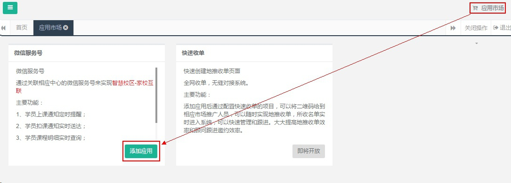
####1.2、学员绑定使用功能
家长通过关注校区微信服务号，输入学员卡号或者手机号进行绑定，学员情况查询（上课记录，剩余课时，课评等）和接受消息（约课通知，扣课通知等）。
		在未签约之前，学员家长仍然可以通过手机号绑定到系统里，当顾问在系统里排了体验课以后，家长也可以查看已预约体验课情况。在上课前一天同样会收到体验课的预约提醒。
如下图是微信家长端收到的提醒页面，提醒是由微信限定行业模板，不可自由添加和修改。
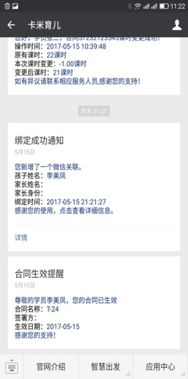

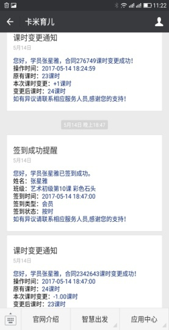
####1.3、卡米智慧校区微信应用配置
在【微信应用】的【上课时间提醒设置】设置起止时间，会在设置的时间内给第二天上课的学员推送上课信息通知。（因微信刷新机制限制，需要至少提前一天预约。）
举例：今天是周三，周三排周五的课，周四学员可以收到上课提醒！
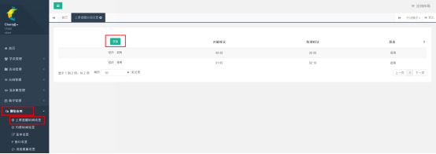
在【微信应用】的【约课时间设置】设置哪些日期内的课程可在线预约。 
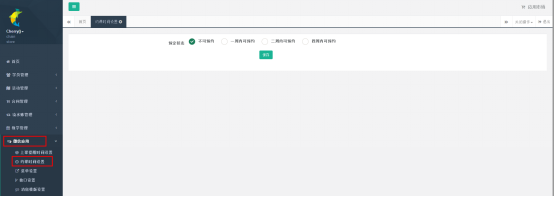
在【微信应用】的【消息模板设置】选择开启消息提醒。
**默认同步系统设置，不需要操作。**
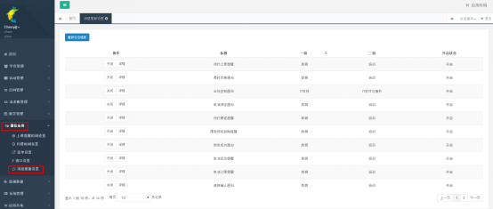
####1.4、课评功能
可以转发给朋友和分享到朋友圈。
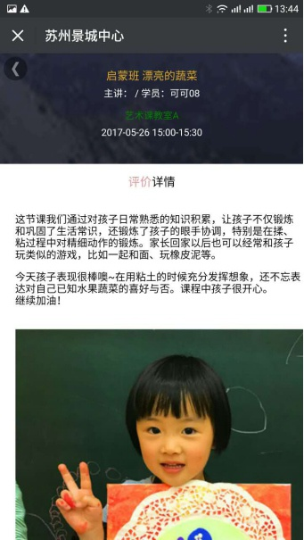
###家长端页面功能介绍
系统平台设置好以后，微信服务号会有一个学员中心的菜单，点击菜单会提示绑定学员，如下页面：
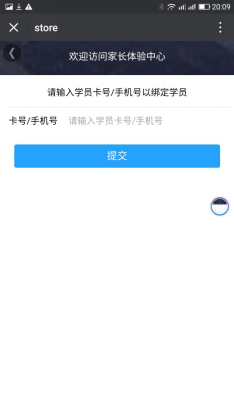
当需要绑定多个孩子的上课信息里，可以点右边图像，会出现已经绑定的学员信息，继续点下面的“+”号即可绑定新学员。
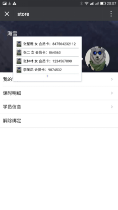
切换绑定学员后即是当前学员的课程信息。
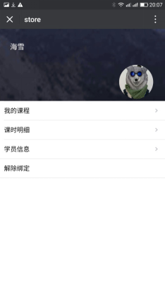

点击我的课程，即可进入已经预约课程信息详细页面。
在此页面可以看到已经预约的课程及签到情况。
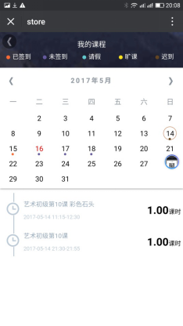
点左上角返回按钮，可以返回首页。
点课时明细，可以看到当前学员的合同概况。
点课时变动明细，可以看到合同课时的变动明细。
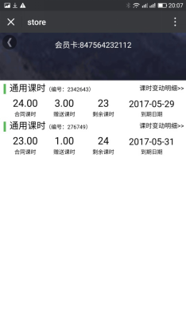
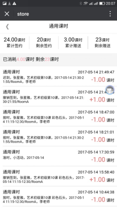
点左上角返回按钮，可以返回首页。点学员信息，可以进入学员信息页。点会员卡，即可扫码签到。
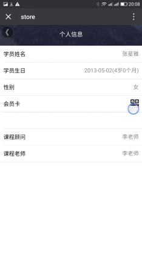

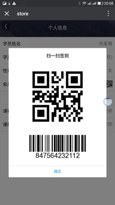