title:微信服务号应用开通-卡米智慧校区
keywords:卡米智慧校区,早教管理系统,教育管理系统,会员卡系统,学生管理系统,早教CRM,学员卡系统,学校管理系统,SAAS,卡米早幼教管理系统,kamios,Kami早教管家,早教SAAS,早教中心管理系统,早教中心招生排课系统,排课软件,培训学校管理系统,培训学校管理软件,培训机构管理系统,培训机构管理软件,早教信息管理系统,排课管理,老师管理,家校互联,龙格亲子游泳,美吉姆,夏加儿,杨梅红,能力风暴
description:卡米智慧校区是全球部署的教育培训机构SAAS管理系统。卡米智慧校区致力于技术和教育的结合，为早幼教培训机构提供更优质的招生管理、合同会员卡管理、教务排课管理、推广运营等系统化的解决方案，为提高教育从业者的工作效率不懈努力，助力机构快速打造互联网+智慧云校区。
tags:早教管理系统,会员卡管理系统,会员卡系统,学生管理系统,早教CRM,学员卡系统,学校管理系统,卡米智慧云SAAS,卡米早幼教管理系统,kamios,Kami早教管家,早教SAAS,早教中心管理系统,早教中心招生排课系统,排课软件,培训学校管理系统,培训学校管理软件,培训机构管理系统,培训机构管理软件,早教信息管理系统
url:wxfwhkt.html

###第一步，提交应用申请。
管理员进入系统后，点击右上角“应用市场”，进入应用市场页面。
找到微信服务号应用，点击“添加应用”。
等待卡米智慧校区客服工作人员审核确认。
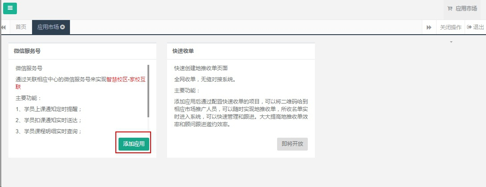
###第二步，确认微信服务号是否符合接入标准。
以下信息如果不能确认，请联系卡米智慧校区客服工程师协助配置
####2.1、微信为认证通过的服务号
微信公众平台登陆：http://mp.weixin.qq.com
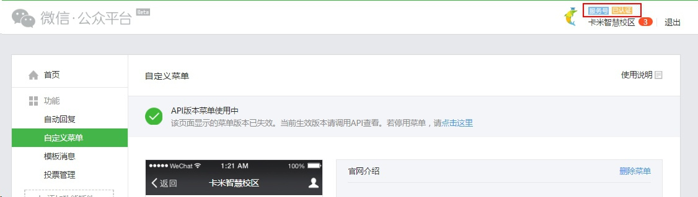
####2.2、成为开发者
并能提供开发者ID和密钥
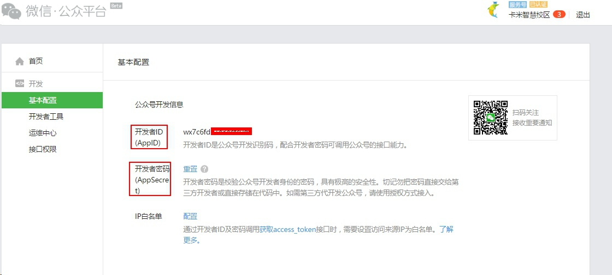
####2.3、添加功能插件-模板消息
模板消息所在的行业必须为：IT科技 IT软件与服务，教育 培训

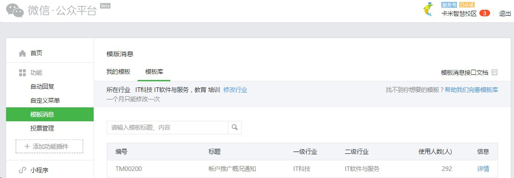
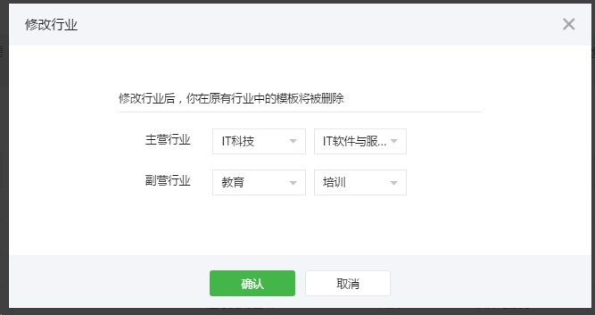
####2.4、添加功能插件-自定义菜单
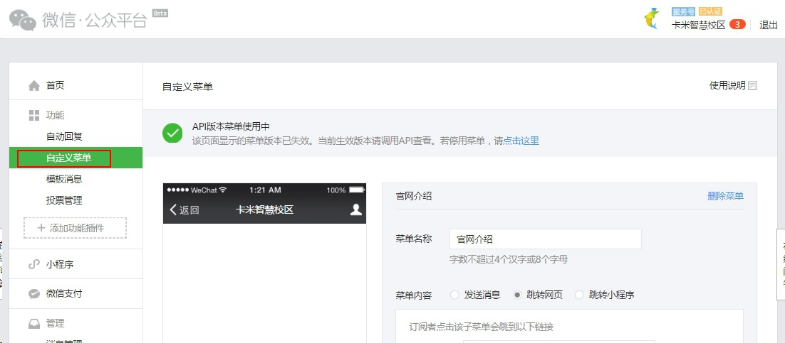
####2.5、设置授权域名
**此项很重要**
进入微信公众账号后台-公众账号设置，点网页授权域名后面的设置按钮。
**将第3条的文件下载并转发给卡米智慧校区的客服工程师即可。**
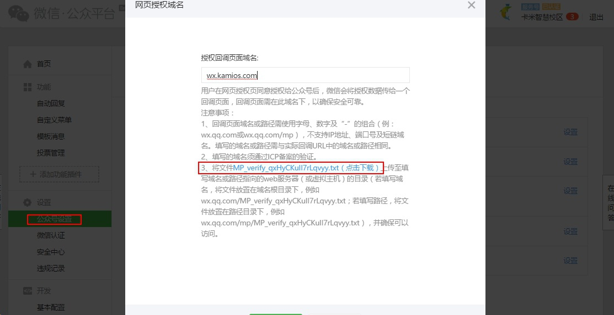
####2.6、设置IP白名单
点基础配置——IP白名单-配置
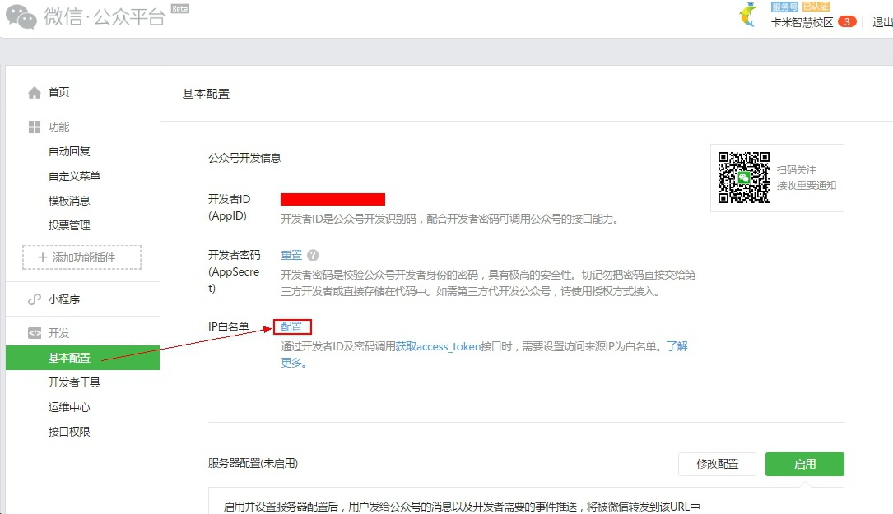
在配置弹窗里添加白名单IP：139.224.195.66，确认修改即可。
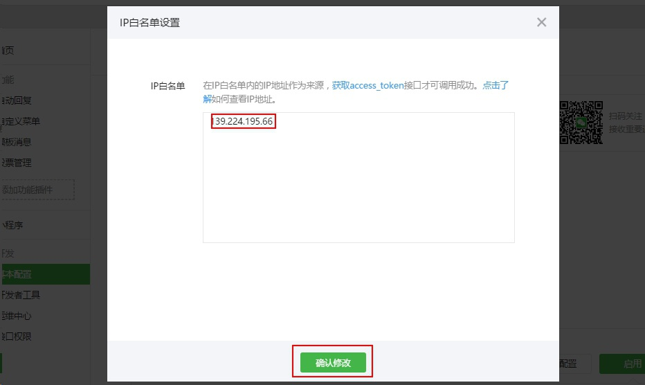

###第三步，卡米智慧校区微信应用功能配置
**此步骤会由我们的客服工程师远程协助校区中心进行配置。**
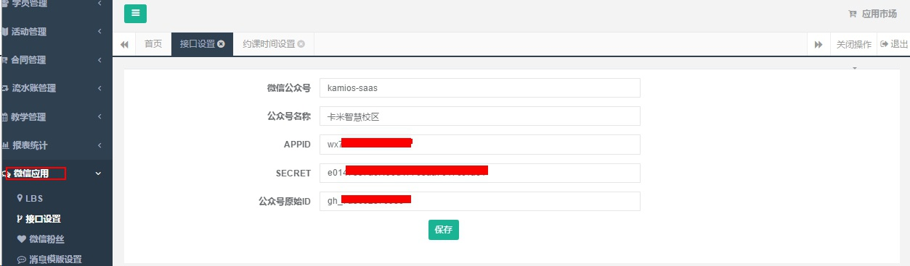
校区中心需要对可以预约的约课时间及上课提醒发送时间进行设置。
约课时间设置：
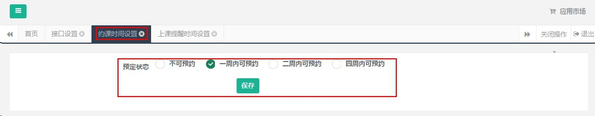
上课提醒时间设置：
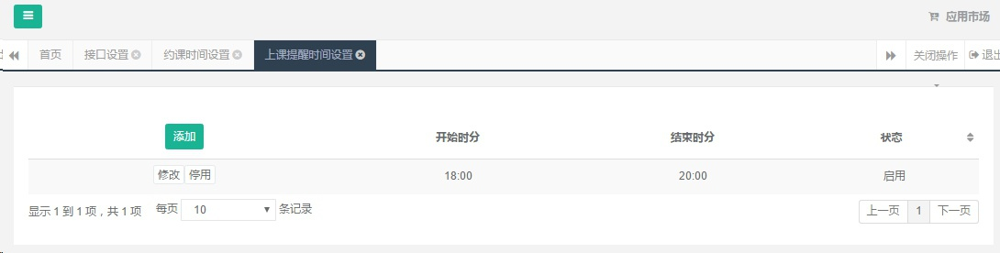