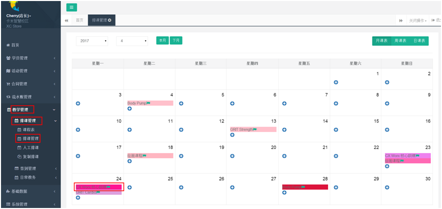
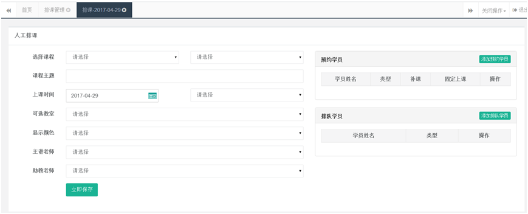
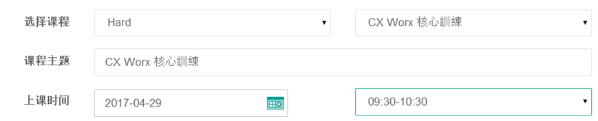
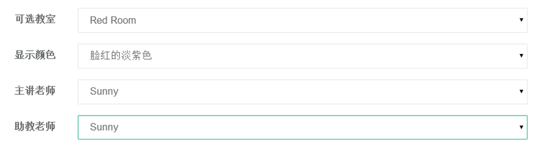
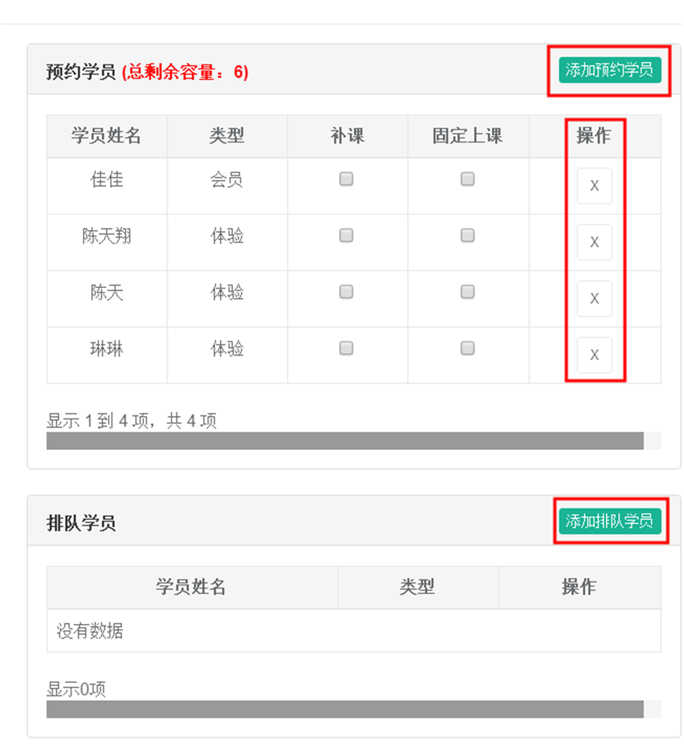
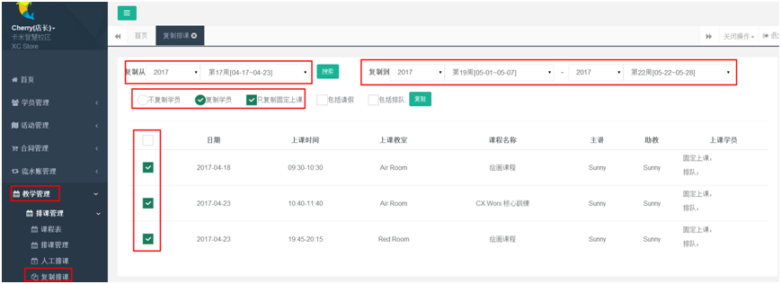

title:排课管理-卡米智慧校区
keywords:卡米智慧校区,早教管理系统,教育管理系统,会员卡系统,学生管理系统,早教CRM,学员卡系统,学校管理系统,SAAS,卡米早幼教管理系统,kamios,Kami早教管家,早教SAAS,早教中心管理系统,早教中心招生排课系统,排课软件,培训学校管理系统,培训学校管理软件,培训机构管理系统,培训机构管理软件,早教信息管理系统,排课管理,老师管理,家校互联,龙格亲子游泳,美吉姆,夏加儿,杨梅红,能力风暴
description:卡米智慧校区是全球部署的教育培训机构SAAS管理系统。卡米智慧校区致力于技术和教育的结合，为早幼教培训机构提供更优质的招生管理、合同会员卡管理、教务排课管理、推广运营等系统化的解决方案，为提高教育从业者的工作效率不懈努力，助力机构快速打造互联网+智慧云校区。
tags:早教管理系统,会员卡管理系统,会员卡系统,学生管理系统,早教CRM,学员卡系统,学校管理系统,卡米智慧云SAAS,卡米早幼教管理系统,kamios,Kami早教管家,早教SAAS,早教中心管理系统,早教中心招生排课系统,排课软件,培训学校管理系统,培训学校管理软件,培训机构管理系统,培训机构管理软件,早教信息管理系统
url:pkgl.html

### 1、如何使用系统进行添加排课？
【教学管理】-【排课管理】-【排课管理】，点“+”按钮即可添加排课，
可以通过右上角的月课表、周课表、日课表分别查看和添加排课课程。
点击日期上面的”+“ ,或者点击人工排课 ，后面标有旗子标志的表示有空位可以添加排课学员。

###2、添加排课页面如何操作？
点击“+”按钮后，在出现的页面里进行排课添加学员等操作。

####2.1、选择课程系列，课程主题，上课时间。
课程主题可以根据实际情况修改建议保留默认的课程名称。
比如课程系列：儿童画，课程名称：儿童画初级，课程主题可以设置为儿童画初级 T12彩色的石头，
这样添加的“ T12彩色的石头”表示儿童画初级的第12节课，主题内容是”彩色的石头“，这里可以根据当周的具体课程名称来添加，添加后的课程主题会同步显示在学员微信端。

####2.2、选择上课教室，显示颜色，主讲老师，助教老师。
显示颜色建议一个课程名称选择一个固定的颜色，以方便查看。

####2.3、添加预约学员和排队学员
可对添加学员选择是补位还是固定上课，点击立即保存即可。如果预约学员取消，可点击操作中的“X”删除，已经签到过的学员不能删除，需要先撤消签到后再删除。
勾选固定上课的学员，在做【复制排课】操作的时候会显示在复制列表中。

###3、复制课表
如已安排的课程，上课时间，教室，老师基本固定，只需稍微调整上课主题或者增加删除个别学生的话，建议在排好一周的课表，将这周的课表在【排课复制】进行复制。
