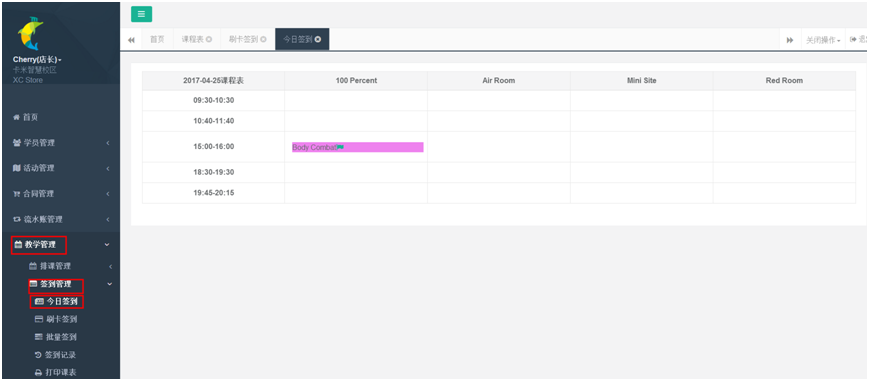
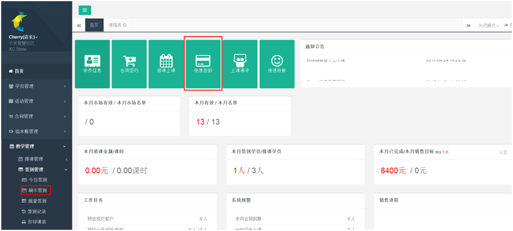
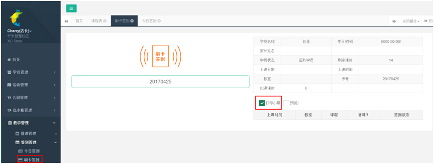
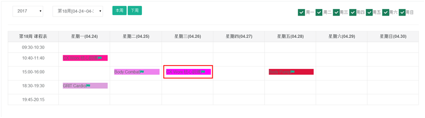
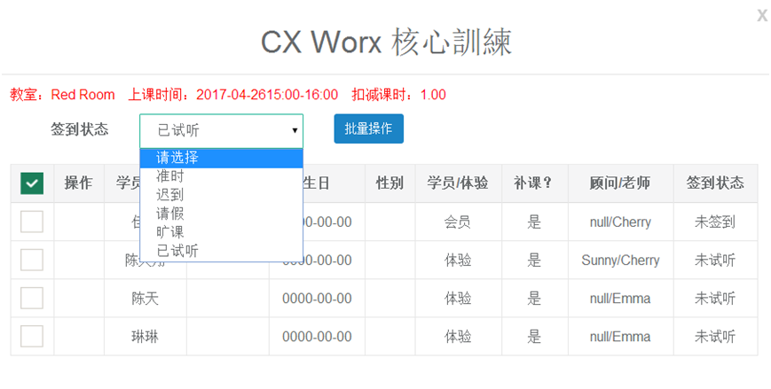
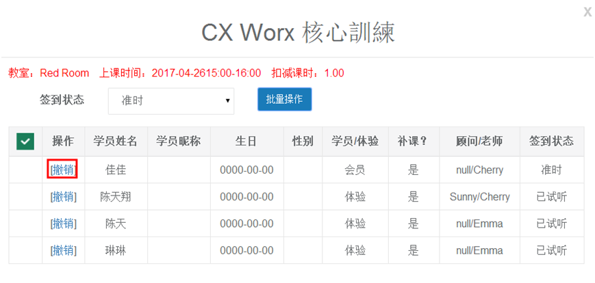
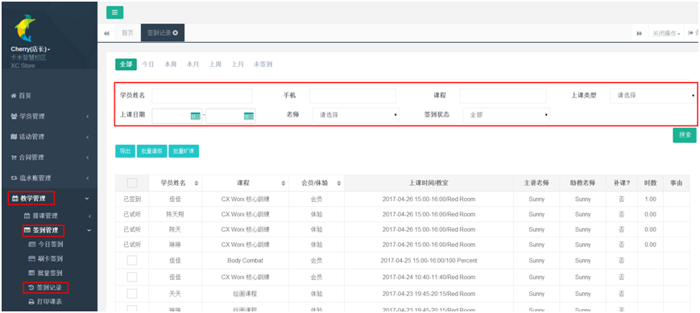
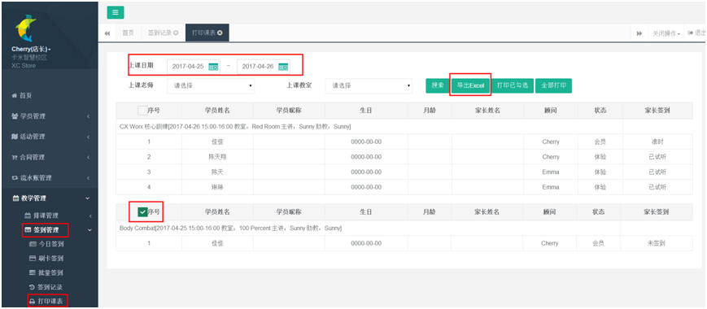

title:签到管理-卡米智慧校区
keywords:卡米智慧校区,早教管理系统,教育管理系统,会员卡系统,学生管理系统,早教CRM,学员卡系统,学校管理系统,SAAS,卡米早幼教管理系统,kamios,Kami早教管家,早教SAAS,早教中心管理系统,早教中心招生排课系统,排课软件,培训学校管理系统,培训学校管理软件,培训机构管理系统,培训机构管理软件,早教信息管理系统,排课管理,老师管理,家校互联,龙格亲子游泳,美吉姆,夏加儿,杨梅红,能力风暴
description:卡米智慧校区是全球部署的教育培训机构SAAS管理系统。卡米智慧校区致力于技术和教育的结合，为早幼教培训机构提供更优质的招生管理、合同会员卡管理、教务排课管理、推广运营等系统化的解决方案，为提高教育从业者的工作效率不懈努力，助力机构快速打造互联网+智慧云校区。
tags:早教管理系统,会员卡管理系统,会员卡系统,学生管理系统,早教CRM,学员卡系统,学校管理系统,卡米智慧云SAAS,卡米早幼教管理系统,kamios,Kami早教管家,早教SAAS,早教中心管理系统,早教中心招生排课系统,排课软件,培训学校管理系统,培训学校管理软件,培训机构管理系统,培训机构管理软件,早教信息管理系统
url:qdgl.html

###1、今日签到
在【教学管理】-【签到管理】-【今日签到】查看今天已经排好的上课课程。
点击相应课程即可弹出签到窗口，如果没有学员上课，则无弹出窗口。

###2、快速签到与刷卡签到

在【桌面】上点击【快速签到】或者【教学管理】>【签到管理】中点【刷卡签到】可通过刷会员卡或者输入会员卡进行签到，勾选打印小票，可在签到后打印小票（需要先先在操作的电脑上连接好[小票打印机和读卡器(target=_blank)](/kamiws.html)）。
####2.1、云打印控件的下载
云打印控件的下载链接：[点击下载(target=_blank)](http://www.c-lodop.com/demolist/CLodop_Setup_for_Win32NT.zip)

###3、批量签到
在【批量签到】里批量签到当天和之前的课表，主要用于补签到以往课表和批量签到当日课表。
（1）、点击具体某天的某个班级。

（2）、根据学员签到情况选择签到状态批量签到。

注意： 1、签约学员无法选择已试听。
            2、体验的学员只能选择已试听，选择其他状态无法签到。
            3、如果会员状态已签到，但选择状态有误，可点击撤销，将其更改为正确的签到状态即可。

###4、签到记录

在【签到管理】>【签到记录】，可通过快速搜索查询到所查学员的签到记录和相应主教老师的上课记录。

###5、打印课表

在【签到管理】>【打印课表】，选择上课日期，导出课表，也可以直接勾选进行打印。
