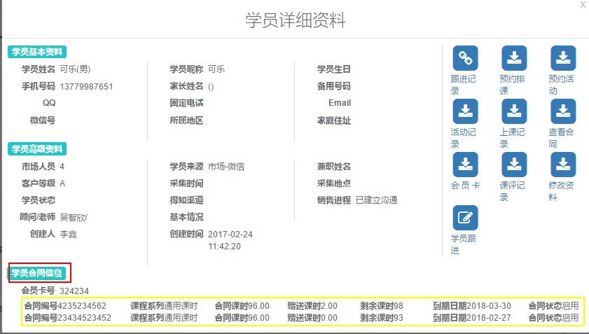
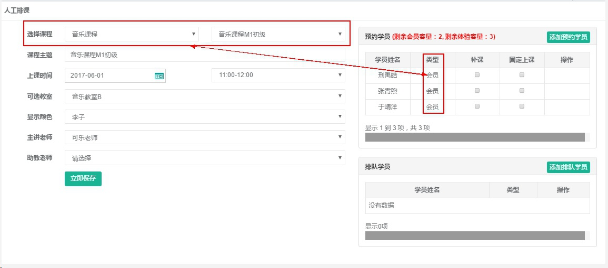

title:会员排课为什么会是体验-卡米智慧校区
keywords:卡米智慧校区,早教管理系统,教育管理系统,会员卡系统,学生管理系统,早教CRM,学员卡系统,学校管理系统,SAAS,卡米早幼教管理系统,kamios,Kami早教管家,早教SAAS,早教中心管理系统,早教中心招生排课系统,排课软件,培训学校管理系统,培训学校管理软件,培训机构管理系统,培训机构管理软件,早教信息管理系统,排课管理,老师管理,家校互联,龙格亲子游泳,美吉姆,夏加儿,杨梅红,能力风暴
description:卡米智慧校区是全球部署的教育培训机构SAAS管理系统。卡米智慧校区致力于技术和教育的结合，为早幼教培训机构提供更优质的招生管理、合同会员卡管理、教务排课管理、推广运营等系统化的解决方案，为提高教育从业者的工作效率不懈努力，助力机构快速打造互联网+智慧云校区。
tags:早教管理系统,会员卡管理系统,会员卡系统,学生管理系统,早教CRM,学员卡系统,学校管理系统,卡米智慧云SAAS,卡米早幼教管理系统,kamios,Kami早教管家,早教SAAS,早教中心管理系统,早教中心招生排课系统,排课软件,培训学校管理系统,培训学校管理软件,培训机构管理系统,培训机构管理软件,早教信息管理系统
url:hypksty.html

*   卡米智慧校区早教管理系统会员排课显示体验的相关问题：
    > 会员排课为什么会是体验？
    > 有合同的会员排课显示体验如何处理？
    > 有合同的会员排活动显示体验如何处理？
    > 为什么会员课显示体验？
    > 会员排课显示体验如何处理？

**产生原因：**
1、签约学员合同导入错误。
2、签约学员作废了合同，未注销会员卡。

**处理思路：**
1、确认是否是签约会员。
2、确认排课学员是否有对应这个课程系列的合同。（[区分通用课时和专用课时(target=_blank)](/qdht.html#toc_2)）
3、确认合同是否到期。
4、确认合同是否还有课时。

**解决办法：**
1、不是签约学员或没有相应课程系列课程的可以根据具体情况手动签约处理。
2、合同到期的可以根据学员的具体情况做合同延期处理。
3、合同导入错误或是学员删除未注销会员卡产生的排课为体验的情况，需要将学员信息修改或作废合同、注销会员卡、删除学员信息，然后手动做新的学员信息、会员卡和合同。

查看学员的详细资料：

排课时注意所选择的上课课程：
