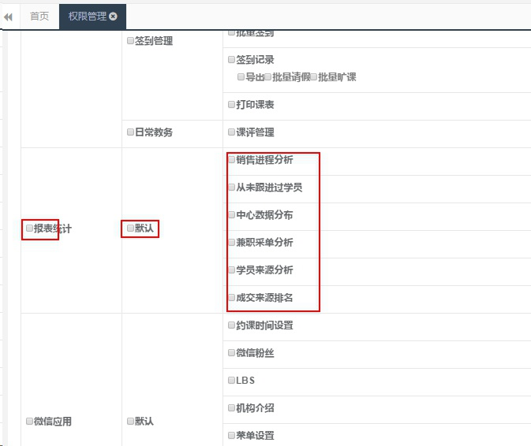

title:卡米智慧校区早教管理系统更新了，为什么我没有更新后的菜单？
keywords:卡米智慧校区,早教管理系统,教育管理系统,会员卡系统,学生管理系统,早教CRM,学员卡系统,学校管理系统,SAAS,卡米早幼教管理系统,kamios,Kami早教管家,早教SAAS,早教中心管理系统,早教中心招生排课系统,排课软件,培训学校管理系统,培训学校管理软件,培训机构管理系统,培训机构管理软件,早教信息管理系统,排课管理,老师管理,家校互联,龙格亲子游泳,美吉姆,夏加儿,杨梅红,能力风暴
description:卡米智慧校区是全球部署的教育培训机构SAAS管理系统。卡米智慧校区致力于技术和教育的结合，为早幼教培训机构提供更优质的招生管理、合同会员卡管理、教务排课管理、推广运营等系统化的解决方案，为提高教育从业者的工作效率不懈努力，助力机构快速打造互联网+智慧云校区。
tags:早教管理系统,会员卡管理系统,会员卡系统,学生管理系统,早教CRM,学员卡系统,学校管理系统,卡米智慧云SAAS,卡米早幼教管理系统,kamios,Kami早教管家,早教SAAS,早教中心管理系统,早教中心招生排课系统,排课软件,培训学校管理系统,培训学校管理软件,培训机构管理系统,培训机构管理软件,早教信息管理系统,卡米智慧校区常用帮助手册,卡米智慧校区快速使用手册,早教管理软件快速使用手册
url:gxsscd.html

*   卡米智慧校区早教管理系统菜单权限的相关问题：
    > 卡米智慧校区早教管理系统更新了，为什么我没有更新后的菜单？
    > 卡米智慧校区早教管理系统的菜单权限在哪里调整？
    > 如何设置不同员工的权限？
    > 如何给员工分配权限？
    > 员工权限可以更改吗？

**产生原因：**
1、卡米智慧校区早教管理系统升级更新后的菜单默认只有管理员才有。
2、权限未做相应配置勾选。

**处理思路：**
做权限管理设置

**解决办法：**
用[管理员(target=_blank)](/yhgl.html)或有设置权限的用户账号登陆系统进行设置。
系统路径：**基础数据——基础信息设置——权限管理**——修改相应角色的权限。

在方框里打勾，相应的角色就可以拥有并使用相应的系统菜单：
