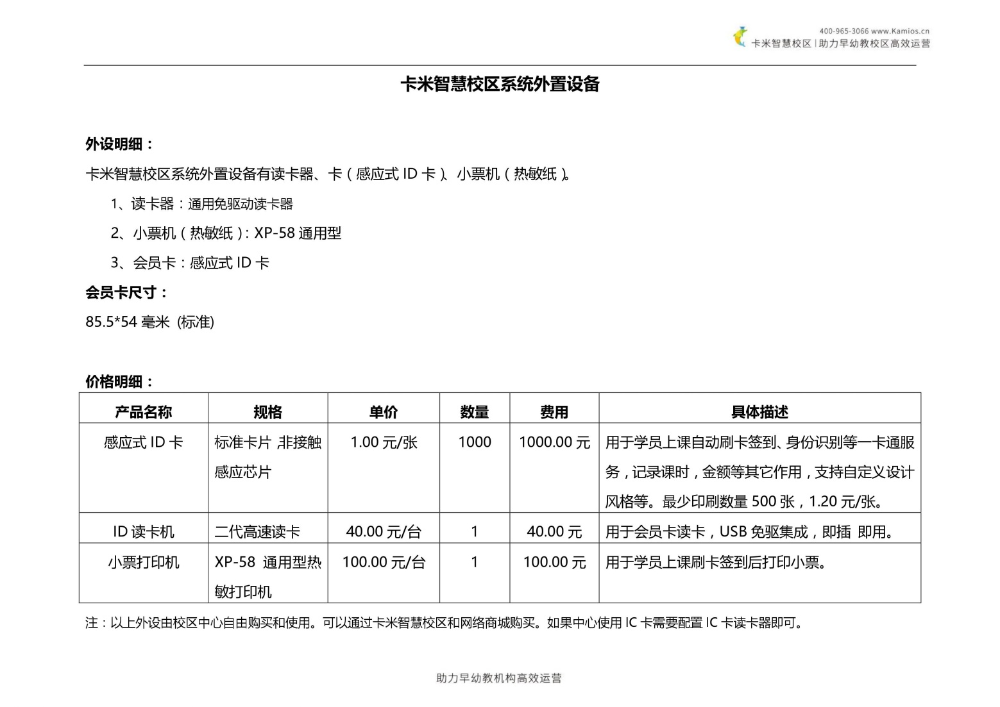

title:卡米智慧校区所使用和匹配的外设
keywords:卡米智慧校区,早教管理系统,教育管理系统,会员卡系统,学生管理系统,早教CRM,学员卡系统,学校管理系统,SAAS,卡米早幼教管理系统,kamios,Kami早教管家,早教SAAS,早教中心管理系统,早教中心招生排课系统,排课软件,培训学校管理系统,培训学校管理软件,培训机构管理系统,培训机构管理软件,早教信息管理系统,排课管理,老师管理,家校互联,龙格亲子游泳,美吉姆,夏加儿,杨梅红,能力风暴
description:卡米智慧校区是全球部署的教育培训机构SAAS管理系统。卡米智慧校区致力于技术和教育的结合，为早幼教培训机构提供更优质的招生管理、合同会员卡管理、教务排课管理、推广运营等系统化的解决方案，为提高教育从业者的工作效率不懈努力，助力机构快速打造互联网+智慧云校区。
tags:早教管理系统,会员卡管理系统,会员卡系统,学生管理系统,早教CRM,学员卡系统,学校管理系统,卡米智慧云SAAS,卡米早幼教管理系统,kamios,Kami早教管家,早教SAAS,早教中心管理系统,早教中心招生排课系统,排课软件,培训学校管理系统,培训学校管理软件,培训机构管理系统,培训机构管理软件,早教信息管理系统,卡米智慧校区常用帮助手册,热敏打印机,小票打印机,感应式ID读卡器
url:kamiws.html

###卡米智慧校区通用外设
卡米智慧校区外置设备有读卡器、卡（感应式 ID 卡）、小票机（热敏纸）。
1、读卡器：通用免驱动读卡器
2、小票机（热敏纸）：XP-58 通用型
3、会员卡：感应式 ID 卡
以上外设各类早教培训机构、幼儿培训机构和青少年教育培训机构可以自行去通过品牌总部或淘宝等渠道购买使用。
也可以通过卡米智慧校区相应运维顾问进行购买。

*   卡米智慧校区早教管理系统会员卡相关问题：
    > 会员卡多少费用？
    > 会员卡印制什么时候发货？
    > 会员卡多少钱一张？
    > 会员卡多少张起印？
    
**备注：会员卡印制在定稿后一至两周内发货。如需要急件请自行联系供应商。**