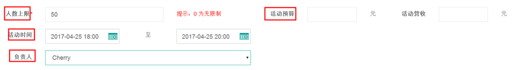

title:卡米智慧校区如何新增添加活动
keywords:卡米智慧校区,早教管理系统,教育管理系统,会员卡系统,学生管理系统,早教CRM,学员卡系统,学校管理系统,SAAS,卡米早幼教管理系统,kamios,Kami早教管家,早教SAAS,早教中心管理系统,早教中心招生排课系统,排课软件,培训学校管理系统,培训学校管理软件,培训机构管理系统,培训机构管理软件,早教信息管理系统,排课管理,老师管理,家校互联,龙格亲子游泳,美吉姆,夏加儿,杨梅红,能力风暴
description:卡米智慧校区是全球部署的教育培训机构SAAS管理系统。卡米智慧校区致力于技术和教育的结合，为早幼教培训机构提供更优质的招生管理、合同会员卡管理、教务排课管理、推广运营等系统化的解决方案，为提高教育从业者的工作效率不懈努力，助力机构快速打造互联网+智慧云校区。
tags:早教管理系统,会员卡管理系统,会员卡系统,学生管理系统,早教CRM,学员卡系统,学校管理系统,卡米智慧云SAAS,卡米早幼教管理系统,kamios,Kami早教管家,早教SAAS,早教中心管理系统,早教中心招生排课系统,排课软件,培训学校管理系统,培训学校管理软件,培训机构管理系统,培训机构管理软件,早教信息管理系统,卡米智慧校区常用帮助手册
url:xzhd.html

###如何通过系统新增活动？
####1、通过活动管理-新增活动添加
在【活动管理】的【新增活动】添加免费或者收费活动。

####2、填写活动主题，选择活动地点。

####3、选择活动类别和活动性质。

注意：如果活动是收费的，学员可以选择扣课时或者缴费，同时可以设置非会员的费用，从而来促进消课以及转介绍。

####4、添加活动设定。
设定人数上限，活动预算，活动时间和负责人。

####5、添加预约参加活动的学员。
#####5.1、通过学员跟进，参加活动预约。
#####5.2、通过活动管理页面预约。
点击【添加新预约】添加参与活动的学员和非学员。

####6、活动内容介绍如何添加。
在【活动详细】添加活动的相关介绍，并保存完成活动添加。
