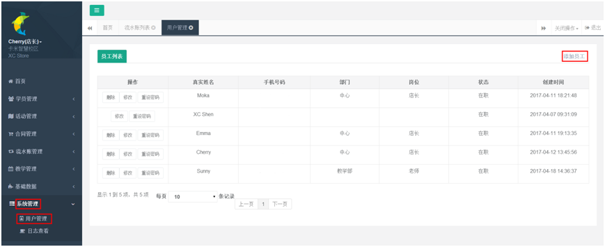
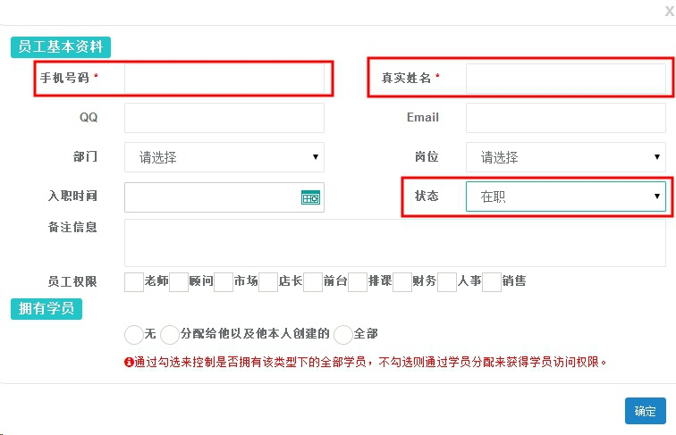
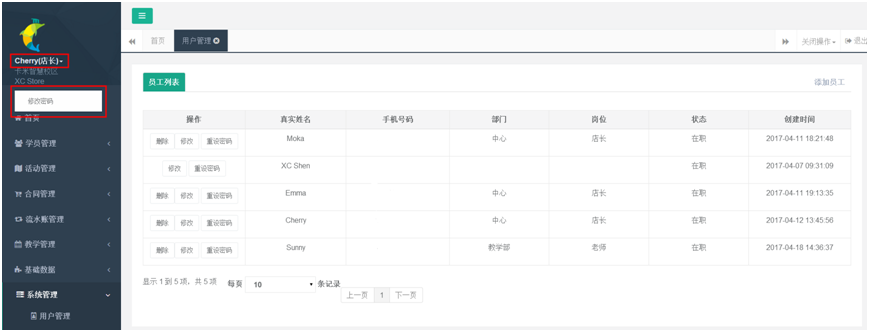
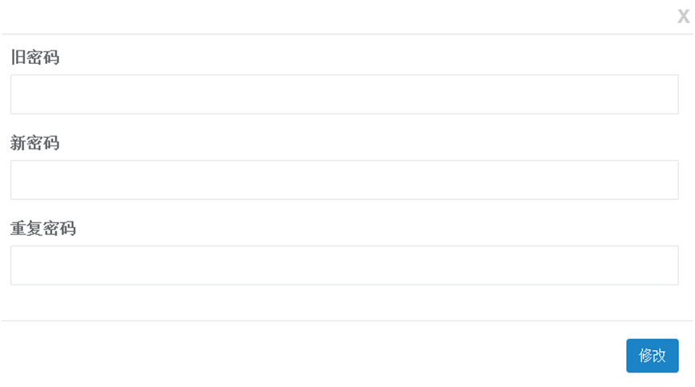

title:卡米智慧校区用户管理
keywords:卡米智慧校区,早教管理系统,教育管理系统,会员卡系统,学生管理系统,早教CRM,学员卡系统,学校管理系统,SAAS,卡米早幼教管理系统,kamios,Kami早教管家,早教SAAS,早教中心管理系统,早教中心招生排课系统,排课软件,培训学校管理系统,培训学校管理软件,培训机构管理系统,培训机构管理软件,早教信息管理系统,排课管理,老师管理,家校互联,龙格亲子游泳,美吉姆,夏加儿,杨梅红,能力风暴
description:卡米智慧校区是全球部署的教育培训机构SAAS管理系统。卡米智慧校区致力于技术和教育的结合，为早幼教培训机构提供更优质的招生管理、合同会员卡管理、教务排课管理、推广运营等系统化的解决方案，为提高教育从业者的工作效率不懈努力，助力机构快速打造互联网+智慧云校区。
tags:早教管理系统,会员卡管理系统,会员卡系统,学生管理系统,早教CRM,学员卡系统,学校管理系统,卡米智慧云SAAS,卡米早幼教管理系统,kamios,Kami早教管家,早教SAAS,早教中心管理系统,早教中心招生排课系统,排课软件,培训学校管理系统,培训学校管理软件,培训机构管理系统,培训机构管理软件,早教信息管理系统,卡米智慧校区常用帮助手册
url:yhgl.html

1、在【系统管理】中【用户管理】的右上角点击【添加员工】。
        **管理员账号：**系统中用户管理里，不能删除的账号为管理员账号，通常为中心负责人。

2、填写真实手机号码，姓名可以填写中文或者英文。状态要选择在职，否则无法登录系统，选择对应权限岗位，点击确定后，既会收到初始密码短信。

**注意事项：**
    A.员工权限需要设置为相应的员工权限。
    B.拥有学员，请根据相应员工权限来进行选择。
    C.老师、顾问、市场为三个专属权限，只在在勾选后，才会在学员资料中相应位置可以选择和分配。

3、点击左上角姓名处，出现修改密码，可以进行密码更改。

