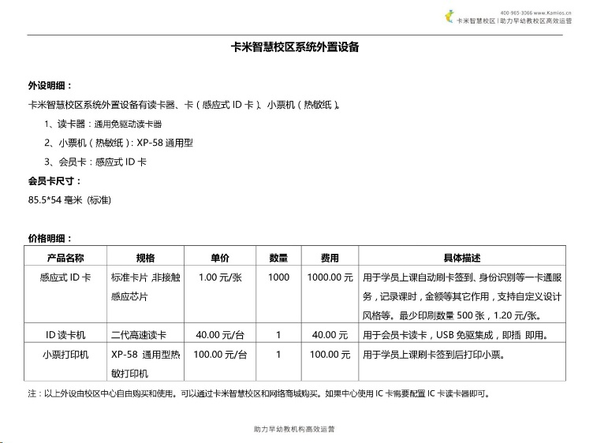

title:卡米智慧校区外设使用-视频介绍
keywords:卡米智慧校区,早教管理系统,教育管理系统,会员卡系统,学生管理系统,早教CRM,学员卡系统,学校管理系统,SAAS,卡米早幼教管理系统,kamios,Kami早教管家,早教SAAS,早教中心管理系统,早教中心招生排课系统,排课软件,培训学校管理系统,培训学校管理软件,培训机构管理系统,培训机构管理软件,早教信息管理系统,排课管理,老师管理,家校互联,龙格亲子游泳,美吉姆,夏加儿,杨梅红,能力风暴
description:卡米智慧校区是全球部署的教育培训机构SAAS管理系统。卡米智慧校区致力于技术和教育的结合，为早幼教培训机构提供更优质的招生管理、合同会员卡管理、教务排课管理、推广运营等系统化的解决方案，为提高教育从业者的工作效率不懈努力，助力机构快速打造互联网+智慧云校区。
tag:早教管理软件基础信息设置,早教管理系统基础信息设置,卡米智慧校区基础信息设置,早教管家基础信息设置
url:wssyvideo.html

点击查看视频：[卡米智慧校区基础数据设置-视频介绍 (target=_blank)](http://player.youku.com/player.php/Type/Folder/Fid//Ob//sid/XMjgyNzk5MjEzMg==/v.swf)