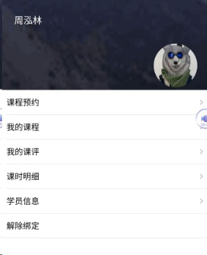

title:卡米智慧校区微信应用-家校互联介绍
keywords:卡米智慧校区,早教管理系统,教育管理系统,会员卡系统,学生管理系统,早教CRM,学员卡系统,学校管理系统,SAAS,卡米早幼教管理系统,kamios,Kami早教管家,早教SAAS,早教中心管理系统,早教中心招生排课系统,排课软件,培训学校管理系统,培训学校管理软件,培训机构管理系统,培训机构管理软件,早教信息管理系统,排课管理,老师管理,家校互联,龙格亲子游泳,美吉姆,夏加儿,杨梅红,能力风暴
description:卡米智慧校区是全球部署的教育培训机构SAAS管理系统。卡米智慧校区致力于技术和教育的结合，为早幼教培训机构提供更优质的招生管理、合同会员卡管理、教务排课管理、推广运营等系统化的解决方案，为提高教育从业者的工作效率不懈努力，助力机构快速打造互联网+智慧云校区。
tags:卡米智慧校区微信应用
url:wxyyvideo.html

卡米智慧校区微信应用-视频截图

点击查看视频：[卡米智慧校区微信应用-家校互联介绍 (target=_blank)](http://m.youku.com/video/id_XMjc4NzcwNTUwMA==.html?spm=a2h2a.8293802.0.0&source=http%3A%2F%2Fi.youku.com%2Fu%2Fprofile%2F%3Fspm%3Da2hww.20020887.mheader_userphoto.A&from=timeline)